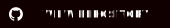

# Preface {-}

The purpose of this book is to become the goto resource about questionable research practices, the steroids of research, and to provide a pedagogical and educational introduction to these practices, and suggest remedies.

**The main point** I am trying to make is that questionable research practices are fundamentally about *reasoning*. [Excluding outliers](#outlier-exclusion), for example, may be related to statistics but the exclusion depends on the reasons given. In other words, there are no statistics in the world that can tell researchers to exclude.^[This relates to the difference between *ontological subjectivity* and *epistemological objectivity* [@hacking_social_1999]. For example, to exclude outliers or not is subjective. But once you decide to exclude outliers, for whatever reason, the question of *how* they are excluded is objective with right and wrong answers.] This means that the "errors of reasoning and irresponsible conclusions from the quantitative case originate from acts, which in principle are performed exactly the same in qualitative research" [@de_groot_meaning_1956, 8]. In order to understand these acts, we need to understand what questionable research practices are, how researchers use and justify them using reasoning, and the possible remedies that helps rectify the problem.

**Why do we need this book?** Science and research should be trusted because of the evidence and arguments it provide. However, some studies turn out to be untrustworthy because of questionable research practices. This makes it important to understand what researchers are actually doing when they do research, and there is a need to bring psychology into methodology [@greenland_need_2017]. As the psychologist Michael J. Mahoney pointed out, who studied other scientists, "can we afford to glibly accept the truths of science without gauging the limitations of its primary instrument?" [@mahoney_scientist_1976, 14].

This book is free of charge. Books at scientific publishing companies are usually too expensive for anyone to buy and receives little attention. Why not just put it online?

## Outline {-}

- **[Chapter 1](#qrp)** describes what questionable research practices (QRPs) are, how common they are, and the consequences of using them.
- **[Chapter 2](#catalogue)** outlines several types of questionable research practices that has been identified in the research literature and when they are likely to mislead.
* **[Chapter 3](#reasons)** introduces several explanations to why questionable research practices occur to help us better understand why research is carried out the way it is.
- **[Chapter 4](#remedies)** suggests how questionable research practices can be prevented by the individual researcher as well research teams and institutions.
- In the appendix you'll also find **[resources and tools](#resources)** that can help with your work, as well as a **[questionable research practices through history](#qrps-history)**.

## About the author {- #author}

[Peter M. Dahlgren](https://peterdahlgren.com/), PhD, studies metascience, selective information search, confirmation bias, and fallacious reasoning.

## Roadmap {-}

Path towards the 1st edition:

☑️ Build website   
☑️ Flesh out book structure   
🟦 Expand catalogue of QRPs and their prevalence   
🟦 Expand catalogue of reasons for QRPs   
🟦 Expand catalogue of remedies   
🟦 Continuous peer review   
🟦 Proofread   
🟦 Provide downloadable PDF and EPUB

The book is written in Markdown using the [bookdown](https://bookdown.org/) R package. The website was released 2022-04-28 and was last built on `r Sys.Date()`. Current word count: `r format_number(word_count())`. The website is updated now and then to reflect the progress.

## Acknowledgments {- #acknowledgments}

Thanks to Rebecca Willén for early reviewing, corrections and feedback; Gustav Nilsonne for reading.

Cover icons: <a href="https://www.vecteezy.com/free-vector/poison" rel="nofollow">Poison Vectors by Vecteezy</a>

::: {.rmdnote}
You can contribute to the book via the [GitHub repository](https://github.com/peterdalle/how-scientists-lie). You will then be included in the acknowledgments. Self-promotion and Reviewer 2 personalities are encouraged!

[](https://github.com/peterdalle/how-scientists-lie)
:::

## How to cite this book {- #cite}

```{r current_year}
year <- substr(Sys.Date(), 1, 4)
```

<ul class="nav nav-tabs" id="citations-tablist" role="tablist">
<li class="nav-item" role="presentation">
<a class="nav-link active" id="cite-apa-tab" data-toggle="tab" href="#cite-apa" role="tab" aria-controls="cite-apa" aria-selected="true">APA</a>
</li>
<li class="nav-item" role="presentation">
<a class="nav-link" id="cite-chicago-tab" data-toggle="tab" href="#cite-chicago" role="tab" aria-controls="cite-chicago" aria-selected="false">Chicago</a>
</li>
<li class="nav-item" role="presentation">
<a class="nav-link" id="cite-vancouver-tab" data-toggle="tab" href="#cite-vancouver" role="tab" aria-controls="cite-vancouver" aria-selected="false">Vancouver</a>
</li>
<li class="nav-item" role="presentation">
<a class="nav-link" id="cite-bibtex-tab" data-toggle="tab" href="#cite-bibtex" role="tab" aria-controls="cite-bibtex" aria-selected="false">BibTeX</a>
</li>
</ul>
<div class="tab-content" id="citations-content">
<div class="tab-pane fade show active" id="cite-apa" role="tabpanel" aria-labelledby="cite-apa-tab">
Dahlgren, P. M. (`r year`). <i>How Scientists Lie</i>. https://howscientistslie.com. doi:<a href="https://doi.org/10.5281/zenodo.6532055">10.5281/zenodo.6532055</a>
</div>
<div class="tab-pane fade" id="cite-chicago" role="tabpanel" aria-labelledby="cite-chicago-tab">
Dahlgren, Peter M. `r year`. <i>How Scientists Lie</i>. https://howscientistslie.com. https://doi.org/10.5281/zenodo.6532055
</div>
<div class="tab-pane fade" id="cite-vancouver" role="tabpanel" aria-labelledby="cite-vancouver-tab">
Dahlgren PM. How Scientists Lie [Internet]. `r year`. Available from: https://howscientistslie.com. https://doi.org/10.5281/zenodo.6532055
</div>
<div class="tab-pane fade" id="cite-bibtex" role="tabpanel" aria-labelledby="cite-bibtex-tab">
```bib
@book{how_scientists_lie,
  title = {How {{Scientists Lie}}},
  author = {Dahlgren, Peter M.},
  year = {`r year`},
  url = {https://howscientistslie.com/},
  doi = {10.5281/zenodo.6532055}
}
```
</div>
</div>

## License {-}

This work is licensed under a <a rel="license" href="https://creativecommons.org/licenses/by-nc-sa/4.0/">Creative Commons Attribution-NonCommercial-ShareAlike 4.0 International License</a>.

<a rel="license" href="https://creativecommons.org/licenses/by-nc-sa/4.0/"></a>

# Email course {-}

Are you a student, junior scholar or a journalist? Do you want to know more about questionable research practices? Subscribe and receive the gist of the book in one short email at a time, delivered every two weeks.

*Subscribe to the waiting list below and you'll receive the first course email as soon as it's ready!*

<div style="padding: 40px; background: #f5f5f5; border-radius: 6px; margin-bottom: 20px">
<form accept-charset="utf-8" action="https://www.backendmedia.se/sendy/subscribe" method="POST">
<input class="form-control form-control-lg mb-2" id="email" name="email" placeholder="Your email" required type="email" />
<div style="display:none;"><label for="hp">HP</label><br>
<input id="hp" name="hp" type="text">
</div>
<input name="list" type="hidden" value="9Qgtv8NaC1NU26BlzcfNXQ"> 
<input name="subform" type="hidden" value="yes">
<div class="form-check">
<input type="checkbox" name="gdpr" id="gdpr" class="form-check-input"> 
<label class="form-check-label" id="gdpr-label" for="gdpr">I agree to the privacy terms below.</label>
</div>
<input class="btn btn-primary mt-3 btn-lg" id="submit" name="submit" type="submit" value="Subscribe to waiting list" />
</form>
</div>

<small>Privacy: Your email is only collected and stored for the purpose of this list. It is not disclosed to anyone else. Opt-out link is included in each email.</small>
