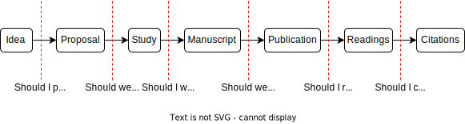
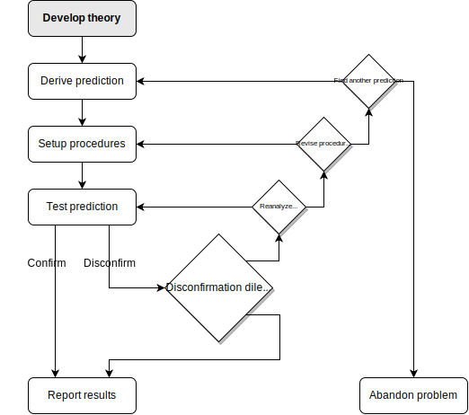
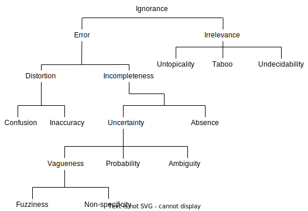

# (PART) Fundamentals {-}

# Questionable research practices {#qrps}

*Questionable research practices*, or just *QRPs*, are the steroids of research. They are the gray area between good research and scientific misconduct. Just like steroids, questionable research practices give a competitive advantage to researchers who use them and may be difficult to detect for an outsider.

Cheating, misconduct, unetichal behavior and questionable research have been discussed since at least the 1800s.^[See appendix ([QRPs through history](#qrps-history)) for an etymology of the term.] However, the term *questionable research practices* originated from a 1992 report by a committee devoted to research integrity:

> Questionable research practices are actions that violate traditional values of the research enterprise and that may be detrimental to the research process. [@research_responsible_1992, 5]

The committee also noted, in 1992, that "there is at present neither broad agreement as to the seriousness of these actions nor any consensus on standards for behavior in such matters" [-@research_responsible_1992, 5]. Since then, the seriousness has been well documented. 

## Why questionable research practices are bad {#qrps-bad}

A research practice can be questionable when a practice is carried out in violation with a particular norm or value. That norm or value can be explicitly stated upfront as a purpose, or implied by a specific discipline or situation. Consequently, we can say that a practice that is *misleading* is a necessary condition for a research practice to be questionable.

In short, there are two important reasons when research practices become questionable and bad:

- When they mislead.
- When they remain undisclosed.

This means that there is nothing wrong with cherry-picking data and telling people that that is exactly what you did. Cherry-picking can be done for educational purposes. Failing to disclose the cherry-picking, however, can be questionable and even scientific misconduct in some instances.^[Another good example is data simulation: letting the computer generate data using random number generators. It is nothing wrong with these as long as they are disclosed as simulations, but become a case of scientific fraud as soon a researcher tries to publish it as real data that has been empirically collected.] 

```{r, results='asis'}
pull_quote("QRPs are the steroids of scientific competition, artificially enhancing performance and producing a kind of arms race in which researchers who strictly play by the rules are at a competitive disadvantage.")
```

Questionable research practices does not say anything about whether people had intent or not to mislead, because practices are about behavior. In other words, questionable research practices are misleading regardless of intent, and they may even be common precisely because researchers are unaware that the practices are questionable.

The line between questionable research practices and scientific misconduct is blurry. Typically, scientific misconduct is often punishable by law or research integrity offices and includes practices such as fabrication, falsification, plagiarism and different types of distortion of the research. While outright fabrication is blatantly improper and more or less universally condemned and outlawed, questionable research practices are in the gray area and may even be accepted by some disciplines even though the research that eminates from these practices are misleading or even completely false. As @john_measuring_2012 argues, questionable research practices (QRPs) gives the researcher room for rationalization and self-deception.

> QRPs are the steroids of scientific competition, artificially enhancing performance and producing a kind of arms race in which researchers who strictly play by the rules are at a competitive disadvantage. QRPs, by nature of the very fact that they are often questionable as opposed to blatantly improper, also offer considerable latitude for rationalization and self-deception. [@john_measuring_2012, 524]

There is a large room for science to be wrong, even repeatedly so, but there is no room for science to be untrustworthy or dishonest. And questionable research practices can mislead not only others but also the researcher who use them. Since they are misleading in the name of science, they also substitute our ignorance with false knowledge, beliefs that are perceived as knowledge but in reality is actually false. This may be far worse since we may stop looking for the right answer when we believe that we already know it.

::: {.rmdnote}
A rule of thumb for determining whether something is a questionable research practice is the following: Would the conclusion (or the certainty of the conclusion) change if some information was disclosed about how the research was carried out? If the answer is yes, then there is a good chance that the research practice is questionable.
:::

## Prevalence of questionable research practices {#qrps-prevalence}

How common are questionable research practices? It has been suggested that they "may constitute the prevailing research norm" [@john_measuring_2012, 524]. But let's take a closer look at the prevalance across different disciplines.

@fanelli_how_2009 provided a review and meta-analysis of 21 surveys and found that an average of about

- 2 percent of scientists admitted to fabrication, falsification, or data modification at least once.
- 34 percent of scientists admitted to other questionable research practices.

```{r qrp-prevalence-data}
data <- read.csv("data/prevalence_of_qrps.csv")
estimates <- as.integer(sub(pattern="%", replacement="" , x=data$estimate))
```

Since then, there has also been a number of studies focusing on questionable research practices. An average of about `r round(mean(estimates))` percent of researchers across disciplines have used questionable research practices, but it varies between `r min(estimates)` and `r max(estimates)` percent depending on the group of researchers.

```{r qrp-prevalence-table, results='as-is'}
library(dplyr)
library(knitr)
library(kableExtra)

data |>
  mutate(population = paste(format_number(sample_size), population)) |>
  select(estimate, population, reference) |>
  kable(col.names = c("Prevalence", "Researchers", "Reference"), align=c("c", "l", "l")) |>
  kable_styling(bootstrap_options = c("striped"))
```

When it comes to scientific misconduct, which is a more gross violation of research norms than questionable researech practices, about 4 percent of Dutch researchers has admitted to fabrication. This number comes from a survey of 6,813 researchers across disciplines [@gopalakrishna_prevalence_2022].

## Where questionable research practices occur {#qrps-where}

```{r science-filters, fig.scap="Science filters.", fig.cap="Research is filtered through many stages along the way. This creates many opportunities for questionable research practices to occur, both for the researcher and for those who filters the research through various stages. Original figure adapted from [Carl T. Bergstrom](https://www.slideshare.net/Carl_Bergstrom/peer-review-filterspptx)."}

```

An idea is filtered through many stages before it reaches its audience. At each stage, there is a risk that some sort of questionable research practice occurs (figure \@ref(fig:science-filters)).

Prestigious journals are supposed to have the best research. Although the question of what constitutes the best research is normative and contested, the prestigious journals are at least treated as if they are the best.

However, articles published in prestigious journals contain a larger amount of questionable research practices, and "results reported in articles published in our most prestigious journals may be less credible than previously believed" [@kepes_questionable_2022, 1].

## Those who use questionable research practices {#qrps-who}

> a scientist’s early-career status, isolation, and lack of scientific integrity might be significant risk factors for producing unreliable results. [@fanelli_meta-assessment_2017, 3714]

## The storybook image of the scientist {#storybook-image}

What characterize a good scientist or a good researcher? According to @mahoney_scientist_1976, the storybook image of a scientists is someone who has

> 1. *Intelligence*, occasionally spiced with creativity;
> 2. Faith and expertise in *logical reasoning*;
> 3. *Experimental* skills which insure the optimal collection of accurate data;
> 4. *Objectivity* and emotional neutrality, with a loyalty only to truth;
> 5. *Flexibility* reflected in a willingness to change one's opinion;
> 6. *Humility* and personal disinterest in fame or recognition;
> 7. *Communality* reflected in an open sharing of knowledge and action cooperation with colleagues; and
> 8. *Suspension of judgment* when scientific evidence is insufficient or unclear.    
> [@mahoney_scientist_1976, 4]

Michael J. Mahoney, a psychologist who studied scientists, made several intriguing observations and found that scientists behaved far from the storybook image:

> He [the scientist] is not the paragon of objective reason; the saintly purveyor of truth. On the contrary, he is thoroughly fallible human being---capable of bigotry, ambition, and political expedience. Far from his mythical image, he is probably the most passionate of professionals. His research and reasoning skills are easily seduced by Procrustean desires---bending the evidence to fit his hypothesis.   
> [@mahoney_scientist_1976, xii]

## Theory-confirmation {#confirmation-bias}

```{r disconfirmation-dilemma, fig.scap="Disconfirmation dilemma.", fig.cap="Researchers who are theory-centered face a dilemma about what they should do when the prediction is disconfirmed. Should they continue reanalyzing the data and hope that this will confirm the prediction? Should they revise the procedures? Or should they find another prediction from the theory? Reporting disconfirmed results may be difficult when journals are only interested in supported theories. Figure adapted from @greenwald_under_1986."}

```

An important aspect of questionable research practices is confirmation bias during the research process. Unfortunately, researchers infrequently report disconfirmed results, but may instead persist trying to confirm the theory or abandon the problem altogether if it cannot be confirmed (figure \@ref(fig:disconfirmation-dilemma)). 

Testing theories and using hypotheses is sometimes considered better, at least anecdotally speaking. There exists an informal hierarchy where predicting something is considered better than merely observing it, and the researcher who predicts may likewise be considered a better researcher than someone who "simply" looks at what's there to be found and tries to make sense of it all. A researcher who believes this hierarchy to be true may be focused on theory-testing and writing hypotheses and trying to confirm them.

When researchers persist testing a theory in hope of a confirmed prediction, they are no longer testing the theory but rather trying to confirm the theory. Then it is only a matter of how productive and persistent the researcher is until the theory becomes confirmed. This means that any research that originates from this process becomes [circular](#circular-reasoning), because the conclusion is predetermined when research is carried out until a particular conclusion emerge.

```{r, results='asis'}
pull_quote("When researchers persist testing a theory in hope of a confirmed prediction, they are no longer testing the theory but rather trying to confirm the theory.")
```

It can be easy to dismiss confirmation bias as something that requires effort or that the researcher needs a prior belief about what the theory and data should show. However, none of that needs to be the case. First, seemingly innocuous behaviors can become victims of confirmation bias. Removing outliers and reanalyzing the data looking for statistically significant results, for instance, could take a couple of seconds but is still a confirmation bias. Second, the researcher does not have to believe anything about the theory or data but only persist in reanalyzing the data until the results become significant. It is similar to hitting the "next" button on the music player until you hear a good tune. One does not need an idea of a particular good tune, it can emerge during the process itself.

In a worst case scenario, a theory-confirmation approach to research starts with the assumption that a particular theory, framework or model is true, and that we just need to find the evidence that proves it. Then a systematic search for that evidence begins. Since the search only stops once enough evidence is gathered in favor of the theory, the conclusion becomes predetermined: supportive of the theory or not yet supportive of the theory.

::: {.rmdnote} 
Note that confirmation bias is not an explanation, but a behavior.^[Note that confirmation bias described in this book is a *positive test strategy*, which is different from the psychological confirmation bias that also takes prior beliefs into account.] Researchers can engage more or less in this behavior. The cause of the behavior, one the other hand, can be many things, such as motivations, incentives or simply routine.^[Beware the risk of circular reasoning here. That is, saying that researchers have a confirmation bias when they are trying to confirm theories is a circular restatement. In other words, trying to confirm theories *is* confirmation bias.]
:::

## Consequences

Questionable research practices makes it easier for researchers to become published and thus more qualified for higher salary, better positions, and increased status. For this reason, they may be very attractive to use and the risk of getting caught is low. However, the practices also have some bad consequences for science as an enterprise, let alone researchers who *doesn't* cheat.

### Overgeneralizations

If researchers repeatedly test theories, and report the successes but not the failures (i.e., confirmed but not disconfirmed predictions), then the results will necessarily be overgeneralized. 

In other words, it may be the case that the theory only applies to certain people, certain situations, or to particular methods or apparatuses. But the fact that disconfirmed predictions are not reported can lead to claims and beliefs that the theory has a broader scope than it really have:

> because no systematic empirical comparison of the evolved (confirming) procedures with earlier (disconfirming) ones has been attempted, the researcher is unlikely to detect the confirmation's dependence on the evolved details of procedure. Although the conclusions from such research need to be qualified by reference to the tried-and-abandoned procedures, those conclusions are often stated only in the more general terms of the guiding theory. Such conclusions constitute avoidable overgeneralizations. [@greenwald_under_1986, 220]

### False-positive findings {#false-positives}

False-positive findings are findings that are false but mistaken as true. For instance, if a study shows that a medical treatment works and we later find out that it actually doesn't work, then we can say that the original finding was a false-positive.

The goal of science is that all findings should be *true-positives*---findings that reflect the true state of what is happening in the world. Even though this goal cannot be fully achieved in practice, it's nonethless a theoretical goal. For starters, it's obviously difficult to know whether a finding is a false-positive since we could have done something wrong which we may not yet know. It's also a question of money and resources. The more certain we want to be, the more it will typically cost.

When researchers are oriented towards confirming theories, it means that the research literature will contain more theories that are confirmed (rather than disconfirmed) where a significant proportion of the theories are also based on false-positives.

@ioannidis_why_2005 suggested that most of published research findings are false-positives. However, others have argued that the number of false positives is considerably lower than Ioannidis initially argued [@leek_is_2017; @schimmack_estimating_2021].

### Inflated effect sizes

```{r inflated-effect-sizes, fig.scap="Inflated effect sizes.", fig.cap="When studies are selected based on their statistical significance, the effect sizes are drastically inflated in small samples."}
library(ggplot2)
library(tidyr)

set.seed(1234)

data <- simulate_phacking(n_simulations=500)$sig_data

fig <- data |> 
  pivot_longer(cols = everything(), names_to="n", values_to="r") |> 
  mutate(n = as.integer(n),
         n = factor(n, levels = sort(unique(n)), ordered = TRUE)) |> 
  na.omit() |>
  ggplot(aes(n, r, color=n)) +
    geom_hline(yintercept = .20, linetype=2, size=0.9, alpha=0.5) +
    geom_jitter() +
    # True correlation line arrow
    geom_curve(x = 1.50, xend = 1.30, curvature = -0.4,
               y = 0.05, yend = 0.18, color="black",
               arrow = arrow(length = unit(0.03, "npc"))) +
    annotate("text", x = 2.2, y = 0.03, label = "Line is the true correlation") +
    # Each point a study arrow
    annotate("text", x = 5.76, y = 0.7, label = "Each point is a study") +
    geom_curve(x = 5.00, xend = 4.30, curvature = 0.4,
               y = 0.70, yend = 0.55, color="black",
               arrow = arrow(length = unit(0.03, "npc"))) +
    scale_x_discrete(labels = paste("n =", c("10", "30", "50", "100", "150", "500", "1000"))) +
    scale_y_continuous(breaks = seq(0, 0.9, by=0.1), limits=c(0, 1),
                       labels = c(seq(0, 0.8, by=0.1), "r = 0.9")) +
    scale_color_brewer(palette = 7, type = "qual") +
    labs(title = "When you only report significant correlations (p < .05)", 
         x = "Sample size",
         y = NULL) +
    theme_howscientistslie() +
    theme(legend.position = "none")
  
plot_interactive_figure(fig, tooltip = c("n", "r"))
```

When studies are selected based on statistical significance, strange things start to happen. The statistics deviates from reality, especially in small samples.

It's often said that larger samples make it easier to reach statistical significance. However, this is only true if the studies are reported as they appear. But once studies are selected based on their statistical significance, it's actually the opposite. It's the studies with *small* samples that produce the largest effect sizes. This might seem counterintuitive at first. However, since a small sample requires a larger effect in order for the study to become significant by chance alone, it follows that only the extreme values will become significant.^[Because the statistical power is too low to detect the real effect size.] 

The consequence is that the effect sizes will be inflated in small samples when we select findings based on their significance. The published literature will look like there are much stronger correlations, much larger differences, and greater treatment effects than there really is. This can be seen in figure \@ref(fig:inflated-effect-sizes), which shows a simulation of studies with different sample sizes that has been selected when they reach statistical significance. The studies with larger samples have more statistical power to detect the small correlation, and are thus more accurate.

### Bad methods spread {#bad-methods}

Questionable research practices make success easier for a researcher by more publications with impressive results. Those who use these practices are therefore in a better position to spread their practices and methods to colleagues and students. Those who use rigorous methods and reasoning, on the other hand, will not achieve the same amount of impressive results and will be less likely to spread their methods. It's a case of the bad gets richer and the good gets poorer.

This process is detailed by @smaldino_natural_2016 who shows the natural selection of bad science through simulation. They argue that:

> Poor research design and data analysis encourage false-positive findings. Such poor methods persist despite perennial calls for improvement, suggesting that they result from something more than just misunderstanding. [...] successful labs produce more ‘progeny,’ such that their methods are more often copied and their students are more likely to start labs of their own. Selection for high output leads to poorer methods and increasingly high false discovery rates. [@smaldino_natural_2016, 1]

### Wastes time and money {#resource-waste}

```{r publication-bias-pendelum, fig.scap="Pendelum of publication bias.", fig.cap="The pendelum of publication bias. Initial positive findings are published in the literature, followed by subsequent research with null findings."}

```

If questionable research practices lead to overgeneralized findings, false-positives, and that the bad methods spread more than the good ones, then it follows that at lot of time and money will be wasted. 

This will be reflected in a research record that consists of a large amount of initial positive findings that stir up excitement and energy in the discipline. Once the hype has passed, the period is followed by a more skeptical outlook and null findings that can more easily be published. In other words, there is a combination of initial demand for positive findings and novelty. But once the novelty for positive findings wears off, the novelty works in the opposite direction: Null findings suddenly becomes novel and more easily publishable because they contradict the early findings. It's like a pendulum swinging from one side to the next.

In a review of beta-blockers and depression, for example, @luijendijk_incentive_2012 argued that a pattern of publications reflect first initial positive findings followed by subsequent null findings: "significant findings are published ahead of nonsignificant findings, and that significant findings seem to provide an incentive to publish nonsignificant studies" [@luijendijk_incentive_2012, 488]. 

After the pendelum has swung in both directions, the question of whether the methods are actually rigorous enough becomes important, and the quest for improvement begins. However, this pendelum movement can take a considerable amount of time---years or decades---and consumes a lot of resources in the meantime. Put simply:

> a tremendous amount of taxpayer money goes down the drain in research that pseudotests theories [@meehl_why_1990, 230]

The theories themselves, that stirred up a lot of excitement in the beginning, may not be resolved, but instead simply fade away and are forgotten once the discipline moves on to the next exciting thing.

### Slowed progress

Science has made tremendous progress, so questionable research practices might seem like a minor problem. But one can easily make the opposite case as well, that science has progressed *despite* questionable research practices. Especially when the pace slows down in order to eventually clean up the mess the questionable practices created in the first place. And more importantly, the larger a discipline becomes, the more it slows down [@chu_slowed_2021].

Resources are always scarce and require trade-offs. If researchers invest time and money into projects that build upon previous questionable research practices, then that new project will inevitably rest on a very fragile foundation. And when [articles are published based on their results](#publication-bias), the fragile foundation will also become difficult to expose and rectify in a timely manner. Instead, the path of least resistance dictates that it's easier to continue with the practices that gets the most articles published. The paradoxical outcome is increased publication speed (which benefits researchers, institutions, and politicians who uses it as a evaluative metric), while science as a whole slows down since it increasingly loses both coherence and contact with reality.

### Illusion of knowledge

```{r taxonomy-of-ignorance, fig.scap="Taxonomy of ignorance.", fig.cap="A taxonomy of ignorance. Questionable research practices can be considered an error that distorts and leaves the research record incomplete. Figure adapted from @smithson_science_1996."}

```

The perhaps greatest consequence of questionable research practices is the illusion of knowledge. One of the most important contributions that scientists and researchers provide is knowledge. But the knowledge is undermined when it's produced and built upon questionable research practices. This can happen in two ways. First, some findings may appear true when they in fact are false. This is an error that distorts. Second, when data, operations or procedures are selectively reported, the findings become incomplete. We learn about the successes but not the failures, which heavily skews the base rates.^[For instance, if we predict a coinflip successfully 44 times out of 100, we have a 44 percent success rate. However, if we only report the successes we have 44 successful predictions out of 44, which gives a 100% success rate. Removing failed predictions from the base number skews the rate.]

Questionable research practices not only gives us the illusion of knowledge, they also prevent us from asking questions that we ought to have asked if we knew that certain findings where indeed inaccurate or uncertain. We remain ignorant despite the fact that we believe that we have knowledge (figure \@ref(fig:taxonomy-of-ignorance)). In some areas of human behavior, this might have detrimental consequences and create unnecessary suffering.

### Lower public trust

When researchers use questionable research practices, and the public finds out, then the integrity of the research institutions themselves are called into question. Why did they let this happen? *How* did they let this happen? And worse, the public may start to distrust the findings that actually are true. It becomes impossible to distinguish the true findings from the false; the valid methods from the invalid; and the good researchers from the bad.

The public expects that scientists and researchers do what is right for the public [@funk_science_2020]. If researchers and scientists are not actively trying to eradicate false findings and questionable research practices, but instead exacerbates them, then it violates the public's trust.

## Summary {#qrps-summary}

Questionable research practices, or QRPs, are actions that violate traditional values of the research enterprise and that may be detrimental to the research process. They are the steroids of research, making it easier for a researcher to gain a competitive advantage over those who play by the rules. In contrast to scientific misconduct, which are blatantly improper, questionable research practices are in the gray area. They are bad because they mislead and are not disclosed, and may give the false impression that the research was carried out in a particular way when in fact it was not. However, there are also circumstances where the same practices would be acceptable, where they do not mislead and do not go undisclosed, and these practices would consequently not constitute questionable research practices.