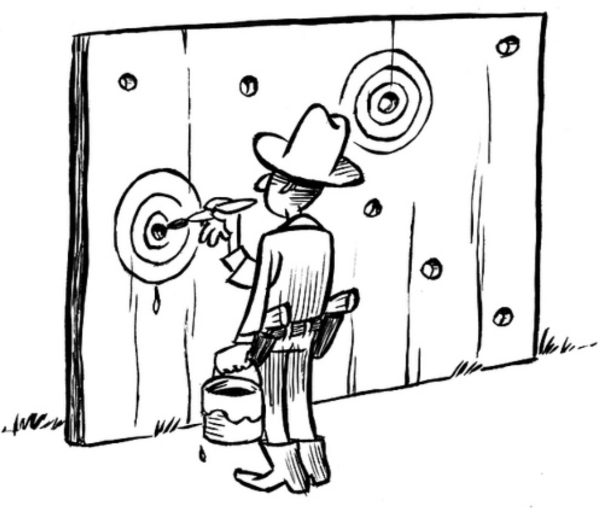

# Catalogue of Questionable Research Practices {#catalogue}

Here you will find a catalogue of questionable research practices.

<!--
Structure for each QRP
-------------------------------------------------------
1. One sentence definition + canonical reference
2. Short example
3. Extended description and application of the QRP
4. Prevalence
5. Remedies
-->

## Selective reporting --- the mother of all questionable resarch practices {#selective-reporting}

Many of the questionable research practices that has been identified so far have one commonality, and that is the selectiveness in the reporting, analyses. In general, selective reporting can be carried out in two ways:

- **Selective inclusion**. Cherry-picking one or more observations so that they are highlighted, when in fact there is no reason (given the purpose) to select these observations over others.

- **Selective omission**. Omitting one or more observations so that they are downplayed, when in fact there is reason to include these observations.

Selective inclusion and selective omission can be carried out simultaneously, so that a researcher cherry-picks one set of observations and omits another set of observations.

```{r, include=knitr::is_html_output(), results="asis"}
include_video("videos/on-being-a scientist-selective-reporting.mp4", caption='The scientist is told to choose one useful result and forget about the rest. From the movie <a href="https://vimeo.com/174396251">On Being a Scientist (2016)</a>.')
```

## Hypothesizing after the results are known (HARKing) {#harking}

```{r, fig.cap="A Texas sharpshooter is someone who fires some gunshots, then paints a shooting target centered on the hits and claims to be a sharpshooter. Illustration by Dirk-Jan Hoek (CC-BY)."}

```

Hypothesizing after the results are known, or HARKing, is presenting an hypothesis that is informed by one's results as if the hypothesis was, in fact, an hypothesis that was conceived earlier [@kerr_harking_1998]. In other words, HARKing is presenting post hoc hypotheses as if they were a priori hypotheses. HARKing is similar to playing the lottery after the numbers have been drawn or, as the picture show, painting the target after shooting the gun.

Note that hypothesizing after the results are known is perfectly permissible if the hypotheses are also disclosed as post hoc. It is also recommended to suggest new hypotheses based on the data. These are all part of an abductive research approach. However, these suggested hypotheses cannot be taken as a test of the data itself since they are derived from the data.

Read more: @rubin_when_2017, @hollenbeck_harking_2017, @lishner_harking_2021, @rubin_costs_nodate.

Also known as: *Texas sharpshooter fallacy*

::: {.rmdnote}
Remedies: [preregistration](#preregistration), [registered report](#registered-report)
:::

## Removing hypothesis that "didn't work"

::: {.rmdnote}
Remedies: [preprint](#preprint), [preregistration](#preregistration), [registered report](#registered-report)
:::

## Publication bias

Publication bias occurs when the outcome of a study biases the decision to publish the study.

::: {.rmdnote}
Remedies: [preprint](#preprint), [preregistration](#preregistration), [registered report](#registered-report)
:::

## Citation bias

Citation bias occurs when an author cites research that preferentially supports a particular claim. Typically, it is research that shows positive findings rather than null findings (or negative findings).

## P-hacking

Also known as: *garden of forking paths*, *multiple comparisons problem*

P-hacking is the practice of conducting more than one analysis, and only reporting the statistically significant results (typically p < .05). It can also mean stopping the analysis once the result is significant. 

The term *hacking* suggests a motivation to achieve a certain result, but p-hacking is a behavior rather than an intention. For this reason, other terms have been suggested, such as *multiple comparison problem*.

@stefan_big_2022 has compiled a list of 12 different p-hacking strategies.

### Selective reporting of the dependent variable

Selective reporting of the dependent variable occurs when you try out different dependent variables in order to ...

### Selective reporting of the independent variable

### Optional stopping

Optional stopping occurs when the data is repeatedly analyzed during the data collection, and the data collection is stopped once the results reaches desirable criteria (such as statistical significance).

However, some variants of optional stopping is appropriate when the false positive rate is controlled [@lakens_performing_2014].

Optional stopping is also known as *data snooping* or *data peeking*.

::: {.rmdnote}
Remedies: [preregistration](#preregistration), [registered report](#registered-report)
:::

### Outlier exclusion

Outlier exclusion is the practice of removing data points that differs from other data points in some way.


```{r, include=knitr::is_html_output(), results="asis"}
include_video("videos/the-dropout-outliers.mp4", caption="The scientists are pressured to remove outliers. From the tv-series The Dropout (2022).")
```

### Controlling for covariates

### Scale redefinition

### Variable transformation

### Discretizing variables

### Exploiting alternative hypothesis tests

### Favorable imputation

### Subgroup analyses

### Incorrect rounding

Incorrect rounding refers to rounding p-values so that they pass below the threshold of 0.05 (or similar).

Rewards such as funding and publication are often tied to significant results. A p-value of 0.049 and a p-value of 0.051 can therefore become the difference between success and failure, even though there is virtually no difference between them from a statistical point of view [@rosnow_statistical_1989]. Rounding the p-value downwards consequently provides a significant benefit for a researcher.

The prevalence of incorrect rounding has been studied in psychology [@nuijten_prevalence_2016] and communication [@matthes_questionable_2015] and appears to be prevalent.

## Combining different practices

Combinining different questionable research practices allows a researcher to maximize the changes of finding a particular result.

For instance, simulations suggests that combining p-hacking practices provide more opportunities to find statistically significant results [@stefan_big_2022; @simmons_false-positive_2011].

## Summary {#catalogue-summary}
