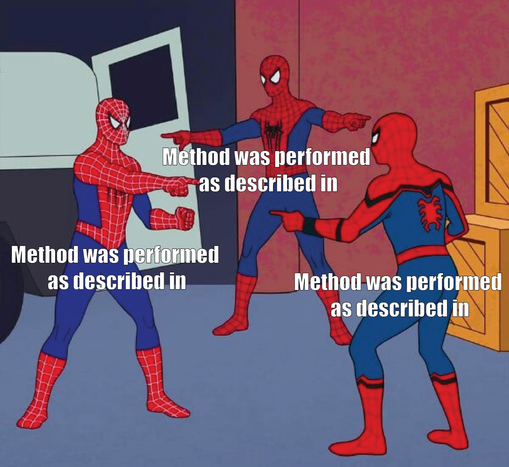

# Catalogue of questionable research practices {#catalogue}

The goal of this catalogue is to detail all questionable research practices (QRPs) that has been identified in the research literature so far, and suggest definitions that can help us understand what we mean with these terms. Examples of possible remedies are also suggested in order to help alleviate the problems.

<!--
Structure for each QRP
-------------------------------------------------------
1. One sentence definition + canonical reference
2. Short example
3. Extended description and application of the QRP
4. Prevalence
5. Remedies
-->

## Selectiveness: the mother of all questionable research practices {#selective-reporting}

Many of the questionable research practices that has been identified throughout the sciences have one commonality, and that is the selectiveness when conducting a study (*selection bias*) or communicating its results (*selective reporting*). 


In general, selectiveness can be carried out in two distinct ways:

- **Selective inclusion**. Cherry-picking one or more observations so that they are highlighted, when there is no reason (given the purpose) to select these observations over others.

- **Selective omission**. Omitting one or more observations so that they are downplayed, when there is reason to include these observations.

Selective inclusion and selective omission can occur simultaneously. A researcher can pick one set of observations and omit another set. These inclusions and omissions are not limited to the data or data collection, but can also occur in a journal article and more specifically in the introduction (e.g., reviewing only supporting evidence), methods section (e.g., omitting critical method references), results and analysis (e.g., omitting experimental groups with insignificant results), and discussion section (e.g., omitting unfavorable conclusions). 

A skilled researcher can thus create a beuatiful narrative by undisclosed inclusions and omissions throughout the research process, cherry-picking the best bits and pieces while downplaying counterevidence and counterarguments, which may give the superificial appeal of science. However, these inclusions and omissions can also be very subtle and difficult to identify. This problem can be summarized succintly:

> Because scientists tend to report only studies (publication bias) or analyses (p-hacking) that "work," readers must ask, "Are these effects true, or do they merely reflect selective reporting?" [@simonsohn_p-curve_2014, 534]

```{r, include=knitr::is_html_output(), results="asis"}
include_video("videos/on-being-a scientist-selective-reporting.mp4", caption='The scientist is told to choose one useful result and forget about the rest. From the movie <a href="https://vimeo.com/174396251">On Being a Scientist (2016)</a>.')
```

## Hypothesizing after the results are known (HARKing) {#harking}

```{r texas-sharpshooter, fig.scap="Hypothesizing after the results are known (HARKing).", fig.cap="Writing hypotheses after the results are known is similar to a Texas sharpshooter who fires some gunshots and then paints a target centered on the hits. Illustration by Dirk-Jan Hoek (CC-BY)."}
knitr::include_graphics("images/texas-sharp-shooter.png")
```

Hypothesizing after the results are known, or HARKing, is presenting an hypothesis that is informed by one's results as if the hypothesis was, in fact, an hypothesis that was conceived earlier [@kerr_harking_1998]. In other words, HARKing is presenting post hoc hypotheses as if they were a priori hypotheses. HARKing is similar to playing the lottery after the numbers have been drawn or, as figure \@ref(fig:texas-sharpshooter) shows, painting the target after firing the gun. As a common proverb goes, it's difficult to make predictions---especially about the future. 

HARKing may be followed by hindsight and [rationalization]. The researcher constructs (or remembers) a seemingly good reason for the hypothesis that can be used to justify the hypothesis in front of reviewers or one's self. For those who read the article the results will follow naturally from the hypothesis and it can give the impression of a capable researcher that is very good at predicting. The researcher can simply write the review section after HARKing, which makes it very easy to construct a good narrative that leads up to the hypothesis that then is confirmed.

Note that HARKing may be perfectly permissible if the hypotheses are also disclosed as post hoc. It's also recommended to suggest new hypotheses based on the data. These are all part of an abductive research approach. However, the suggested hypotheses cannot be taken as a test of the data itself since the hypotheses are derived from the data. That would constitute [circular reasoning](#circular-reasoning).

Read more: @rubin_when_2017, @hollenbeck_harking_2017, @lishner_harking_2021, @rubin_costs_nodate.

::: {.rmdtip}
Remedies include [preregistration](#preregistration) and [registered report](#registered-report) that effectively makes HARKing apparent for a reader.
:::

## Removing unconfirmed hypotheses {#removing-hypotheses}

Removing unconfirmed hypotheses is when a researcher who posits several hypotheses then remove the unconfirmed hypthoses and keep the confirmed hypotheses. 

A common argument for this practice is that only confirmed hypotheses can tell us something new, or that unconfirmed hypotheses are not interesting. This is a problem for hypothesis-testing research because the *testing* of the hypothesis no longer becomes possible when the faith of the hypothesis is dependent on the outcome. Removing unconfirmed hypotheses is rather a [theory-confirmation](#confirmation-bias) approach that blends false-positives and true-positives together. It becomes impossible to determine whether a hypothesis is actually false.

Doctoral students increasingly compete on the academic market for publications in prestigous journals. When we compare the published doctoral theses with the published journal articles (that are derived from the doctoral theses), we find that unconfirmed hypotheses are often removed [@kepes_questionable_2022; @oboyle_chrysalis_2017]. @oboyle_chrysalis_2017 called this the *chrysalis effect* in reference to how butterflies develop. Initial results start out ugly and over time metamorphosize into beautiful published journal articles.

::: {.rmdtip}
Remedies include publishing [preprints](#preprint) that are manuscript put online before submitting to a journal, [preregistration](#preregistration) and [registered report](#registered-report) that makes it easier to publish an article regardless of what the results show.
:::

## Publication bias

Publication bias occurs when the outcome of a study biases the decision to publish the study. This can lead to the infamous *file drawer problem*, which means that studies with null results are never published but instead put in a file drawer and soon forgotten. 

However, it may be unlikely that researchers simply put all their hard work into an empty void that the filedrawer represents. Instead, a researcher may use questionable research practices in order to turn the null result into a positive result that is more publishable [@simmons_false-positive_2011].

The consequence is far greater since it would [increase the number of false findings](#false-positives) in the published literature, and simulatenously cover up the null findings. In a worst case scenario, all theories would appear true and there would be no way of distinguishing them from false theories since null findings cannot be published. For this reason, publication bias is one of the most serious problems to science:

> Publication bias may be the single most important problem to solve in order to increase the efficiency of the scientific project [@ingre_estimating_2018, 11]

Publication bias is particularly a problem when summarizing many studies in reviews and meta-analyses. A meta-analysis is only as good as the data they are based on. Publication bias therefore hinders the ability to draw scientific concusions when some conclusions are less likely to make it into the published literature in the first place. Several techniques for correcting publication bias statistically has been developed, but these techniques are not always widely adopted or sufficient to account for all biases. In communication, for example, the procedures for dealing with publication bias in meta-analyses are often inadequate [@sun_not_2020].

Publishing studies regardless of the outcome is therefore very important in order to successfully counteract publication bias. Journals have been a large part of the problem since they are often only interested in studies that show a confirmed result. However, internet and preprint repositories have changed this for the better since there are less dependency on journals for communicating results.

::: {.rmdtip}
Remedies include [sharing data](#open-data), [preprint](#preprint), [preregistration](#preregistration) and [registered report](#registered-report).
:::

## P-hacking

```{r fwer, fig.scap="P-hacking.", fig.cap="P-hacking relies on the fact that the more statistical tests you do, the easier it becomes to get a statistical significant result that is wrong (a false-positive). One test equals a 5 percent probability of at least one wrong result. Five tests gives about 23 percent probability of at least one wrong result, and so on. Figure shows the family-wise error rate assuming 5 percent significance level."}
library(ggplot2)
library(plotly)

fwer <- data.frame(tests = 1:100, probability = (1 - (0.95 ^ (1:100))))

breaks <- c(seq(0, 1, 0.1), 0.05)
breaks_labels <- paste0(breaks * 100, "%")
breaks_labels[11] <- "\n100%\nprobability"

fig <- fwer |> 
   mutate(Tests = tests, Probability = round(probability, 3)) |> 
   ggplot(aes(Tests, Probability)) +
   geom_line(color = primary_color()) +
   geom_hline(yintercept = 0.05, color = "gray", linetype = 2) +
   scale_x_continuous(breaks = c(1, seq(10, 100, 10))) +
   scale_y_continuous(breaks = breaks,
                      labels = breaks_labels) +
   labs(title = "The probability of a false-positive result depends\non how many tests you do",
        x = "Number of statistical tests",
        y = NULL) +
   theme_howscientistslie()

plot_interactive_figure(fig)
```

P-hacking is "any measure that a researcher applies to render a previously non-significant p-value significant" [@stefan_big_2022, 3]. It can most easily be described as *trying and trying again* in order to reach a significant result (such as p < 0.05).^[There is a history of rich vocabulary on this topic. @mayo_statistical_2018 [p. 92] listed several colorful terms such as "double-counting, cherry picking, fishing, hunting, significance seeking, searching for the pony, trying and trying again, data dredging, monster barring, look elsewhere effect".]

The problem is that the more statistical tests you do, the easier it becomes to reach significance (figure \@ref(fig:fwer)). If you redo an analysis enough times, with slight variation each time, then it's only a matter of persistance until the results become significant even though there is no pattern to be found in the data.

The term *hacking* suggests a motivation to achieve a certain goal, but p-hacking is a behavior or procedure, rather than an intention, since it refers to the number of analyses that have been carried out. Other terms that are more neutral have been suggested, such as *garden of forking paths* [@gelman_garden_2013] that emphasize the many pathways that a researcher could have taken but did not take for each new step on the path, *biasing selection effects* that focuses on how selections can violate the requirements of an analysis [@mayo_statistical_2018], or the older term *multiple comparison problem*. Regardless of the term we use, they all point to the analytical flexibility available to the researcher. That is, the opportunity to reach a predetermined conclusion by systematic trial-and-error until the conclusion will have lost all contact with reality due to random error.

P-hacking may be one of the most studied (and most common) questionable research practices, and many have noted that "p-hacking is widespread throughout science" [@head_extent_2015, 1].

P-hacking is closely tied to the Null-Hypothesis Significance Testing (NHST) philosophy since the *P* refers to the p-value. In principle, however, there is nothing that prevents a researcher who subscribe to another philosophy such as [Bayesianism](#bayes) to also p-hack, although the outcome they are hacking would be something else (such as the Bayes Factor: *BF-hacking*). Whether it's a p-value or a Bayes Factor that a researcher hacks is of no importance here. Instead, the main point can be summarized with Goodhart's law: *When a measure becomes a target, it ceases to be a good measure*.

There are several ways a researcher can p-hack, and @stefan_big_2022 compiled a list of 12 different p-hacking strategies. In figure \@ref(fig:p-hacking), we can see how these different practices contribute to driving up the false positive rate. In general, if we allow 5 percent of the findings to be wrong, transforming a variable can make it so that up to 33 percent of the findings will be wrong. Put differently, if you imagine a regression table with 100 numbers, then 33 of those numbers will be wrong (on average) rather than the expected 5 wrong numbers.

```{r p-hacking, fig.scap="P-hacking.", fig.cap="P-hacking strategies can greatly increase the number of wrong results (false-positives). These data are averages extracted from simulations by @stefan_big_2022, and the actual false positive rate in any given situation can vary greatly."}
library(dplyr)
library(ggplot2)

# Data extracted from Figure 11 in @stefan_big_2022 using https://plotdigitizer.com/app
df <- read.csv("data/p-hacking-false-positives.csv")

fig <- df |> 
  group_by(practice) |> 
  summarize(fpr = mean(false_positive_rate),
            sd  = sd(false_positive_rate)) |> 
  mutate(Practice = reorder(as.factor(practice), fpr),
         `False positives` = round(fpr, 3)) |> 
  ggplot(aes(`False positives`, Practice)) +
  geom_bar(stat="identity", fill = primary_color()) +
  geom_text(aes(label = round(`False positives` * 100)), nudge_x = -.01, color="white") +
  scale_x_continuous(labels = scales::label_percent()) +
  labs(title = "P-hacking greatly increases the number of wrong results",
       x = "Average false positive rate",
       y = NULL) +
  coord_cartesian(expand = FALSE, ylim = c(0, 13), xlim = c(0, .35)) +
  theme_howscientistslie() +
  theme(axis.ticks.y = element_blank(), 
        axis.text.y = element_text(hjust = 0))

plot_interactive_figure(fig, tooltip = c("False positives"))
```

<!--
1. Selective reporting of the dependent variable
2. Selective reporting of the independent variable
3. Optional stopping
4. Outlier exclusion
5. Controlling for covariates
6. Scale redefinition
7. Variable transformation
8. Discretizing variables
9. Exploiting alternative hypothesis tests
10. Favorable imputation
11. Subgroup analyses
12. Incorrect rounding
-->

The main way to deal with these wrong results (i.e. false-positives) is to adjust for the number of tests, using one of the many techniques that are available. Bonferroni correction may be one of the most known, and the simplest, although it may not be suitable in your particular case because it's very conservative and it can be difficult to keep track of how many comparisons has actually been made. However, there are also other remedies such as [checklists](#checklists), [preregistration], [registered report], and [blind analysis].

Almost all of these strategies are perfectly normal in day-to-day science. Scientists need to transform variables or control for covariates. However, they easily mislead when carried out in the systematic trial-and-error manner and the outcome measure is used as the target. The strategies are described in more detail next.

::: {.rmdnote}
Try [Hack Your Way To Scientific Glory](https://projects.fivethirtyeight.com/p-hacking/) using the simulator from the website Five Thirty Eight.
:::

### Selective reporting of the dependent variable {#selective-reporting-dv}

Selective reporting of the dependent variable occurs when you try several dependent variables and report the ones that result in statistical significance. Another common term is *outcome switching*.

This is one of the most frequently used p-hacking practices.

### Selective reporting of the independent variable {#selective-reporting-iv}

Selective reporting of the independent variable occurs when you try several independent variables and report the ones that results in statistical significance.

### Optional stopping

Optional stopping (also called *data snooping* or *data peeking*) occurs when the data is repeatedly analyzed during the data collection, and the data collection is stopped once the results reach statistical significance.

Some variants of optional stopping is appropriate when the false-positive rate is controlled [@lakens_performing_2014]. 

::: {.rmdtip}
Remedies include [preregistration](#preregistration), [registered report](#registered-report) and controlling the false-positive rate [@lakens_performing_2014].
:::

### Outlier exclusion

Outlier exclusion (also called *data trimming*) is the practice of removing observations that differs from other observations in some way. It becomes a questionable research practice when the decision whether to exclude the outliers is taken after looking at the results, since this gives considerable leeway to reach statistical significance.

There are nonetheless several reasons why a researcher would want to exclude outliers. For instance, if a group of people are asked for their age and one of them reports 450 years old, we would consider that an obvious outlier that should be excluded. However, other cases where we deal with things that we are unfamiliar with are less obvious and it can be difficult to find an appropriate cut-off point for exclusions. It can be tempting to set the cut-off point at a lower or higher level in order to turn the result from insigificance to significance.

There are many ways outliers can be excluded. @aguinis_best-practice_2013 identified "14 unique and mutually exclusive outlier definitions, 39 outlier identification techniques, and 20 different ways of handling outliers" [-@aguinis_best-practice_2013, 270]. This makes the room for p-hacking very large, since one can always choose one of these definitions, techniques or ways and try the next one if one does not succeed in getting statistical significance.

```{r s, include=knitr::is_html_output(), results="asis"}
include_video("videos/the-dropout-outliers.mp4", caption="The scientists are pressured to remove outliers. An outlier is defined as a data point that doesn't do what it's supposed to do. From the tv-series The Dropout (2022).")
```

### Controlling for covariates  {#controlling-covariates}

Controlling for covariates is a p-hacking strategy that means trying out different covariates (control variables) until the result is statistically significant.

For instance, an hypothesis such as *X is correlated with Y* might give an insignificant result. However, by introducing a covariate into the model, *X is correlate with Y when controlling for Z*, there is a great opportunity to confirm the hypothesis if one tries different *Z*'s until the result reaches statistical significance.

Just like the other p-hacking strategies, controlling for covariates is not by itself questionable but part of normal science. But repeatedly testing different covariates without reporting all the tests can easily mislead.

### Scale redefinition

Scale redefinition is when a measurement scale is reconstructed into another scale. For instance, two 7-point scales can be converted into a single 14-point scale. It can become a questionable research practice when the decision to redefine the scale is taken after looking at the results for statistical significance.

In some disciplines, most notably the social sciences, scales are often used by asking people who give their answers on a scale, like "How do you feel about this activity?" followed by a set of emotions and corresponding scales from 1 to 7 that indicate intensity. If many similar scales are used, the researchers can test each scale on its own. If the result is insigificant, the researcher can then create a composite scale by combining all of the smaller scales into one larger composite scale that might range from something like 1 to 35, and then test that composite scale instead. If the result is still insigificant, the researcher can try using only *some* of the smaller scales, and so on.

Constructing these scales offers great opportunities to p-hack by increasing or decreasing the number of scales.

### Variable transformation

Variable transformation refers to changing the shape of a variable, for example by taking the logarithm of the variable in order to reach the normality assumption of linear models. It can become a questionable research practice when the decision to transform the variable is taken after looking at the results for statistical significance.

The transformation changes the underlying measurement scale and is therefore closely related to scale redefinition, but it does not need to be a composite scale. And just as the scale redefinition, transformations are not wrong in and of themselves. 

### Discretizing variables

Discretizing variables is a form of variable transformation where a continous variable is turned into groups or categories. It can become a questionable research practice when the decision to discretize the variable is taken after looking at the results for statistical significance.

A common example is age, which can be reported on a continous scale (1, 2, 3, 4, 5 years old, and so on). It can also be discretized into different groups, such as young and old, or generation (1990s, 2000s, 2010s, and so on).

The cut-offs that determines who is considered "young" and "old" provides considerably leeway in order to achieve stastically significant result. We can simply lower the cut-off in order to put more people in the "old" category which may be enough to turn the results significant.

### Exploiting alternative hypothesis tests {#alt-hypothesis-test}

Exploiting alternative hypothesis tests refers to trying out different statistical tests in order to test an hypothesis. It can become a questionable research practice when the decision to use the alternative test is taken after looking at the results for statistical significance.

Let's say that we have a simple hypothesis: "Older people are happier than young people". This can be tested with many statistical models. We could use a t-test, Pearson correlation, Pearson chi-squared or a likelihood ratio test. Some of these tests might give us a significant result, and we simply report one of those and ignore the others. We might also change the parameters (or hyperparameters) of the model in order to make it more likely to achieve a significant result.

> For example, in her statement on p-hacking in power pose research, Dana Carney (2016) reported having applied both a Pearson chi-squared and a likelihood ratio test, and selectively reported only the significant test. [@stefan_big_2022, 25]

### Favorable imputation

Imputation means replacing missing data with fake plausible data. This is a normal operation to handle missing data, but *favorable* imputation can become a questionable research practice when the variables with missing data or the method used for the imputation are not disclosed.

Empirical data is almost never complete, and more or less missing data is almost always unavoidable. Since there are many ways data can be imputed, and there may be many variables that have missing data, there are also many ways to make the results significant by selectively applying imputation on some variables but not others, or by choosing one imputation method over another, or a combination.

### Subgroup analyses

Subgroup analyses is the study of only some of the observations instead of the whole sample. This can become a questionable research practice if the inclusion criteria for the subgroup is based on the result of the analysis.

Let's say you do an experiment on people. During the analysis, you find that young people respond to the treatment, but not the old. A questionable research practice would then be to discard the old people from the analysis when you write the manuscript, and state in the beginning of the manuscript that you only intended to include young people.

These types of changes are pretty common:

> In meta-scientific articles, researchers have often noticed that the same research teams used different participant inclusion rules for testing closely related hypotheses (e.g., Gelman & Loken, 2019; Ingre, 2017; Wagenmakers et al., 2012). In their comparison of Cochrane reviews to their published protocols, Silagy et al. (2002) found that 34% of the reviews had made major changes to participant inclusion criteria. If inclusion criteria are changed based on the statistical significance of core hypothesis tests and the additional tests remain unreported, this practice constitutes a form of p-hacking (Tannock, 1996; Ingre, 2017; Hahn et al., 2000). [@stefan_big_2022, 28-29]

Subgroup analyses is also a common phenomena in experimental research. In an experiment with five treatment groups (A, B, C, D, E), the groups can be compared against each other in many ways: A against B, B against C, A against C, and so on. In total, there are 10 different ways they can be compared.^[A against B, B against C, C against D, D against E, A against C, A against D, A against E, B against D, B against E, and finally C against E.] During the analysis, the researcher might find that only the comparison between A and B provide significant results, and may therefore remove all other groups. In the manuscript, the researcher then states that the purpose was to compare A and B, and gives no mention of the other treatment groups. This is misleading since the false-positive rate is greatly exaggerated.

### Incorrect rounding

Incorrect rounding refers to rounding p-values so that they pass below the threshold of p < 0.05, or whatever threshold is used in a particular discipline.

Rewards such as funding and publication are often tied to significant results. A p-value of 0.049 and a p-value of 0.051 can therefore become the difference between success and failure, even though there is no difference between them from a statistical point of view [@rosnow_statistical_1989]. Rounding the p-value downwards consequently provides a benefit for the researcher. 

The prevalence of incorrect rounding has been studied in psychology [@nuijten_prevalence_2016] and communication [@matthes_questionable_2015] and is prevalent.

## Salami slicing

Salami slicing refers to the practice of cutting up a manuscript or research into many smaller manuscripts in order to achieve more publications and citations. Sometimes the output of salami slicing is referred to as the *least publishable unit*. Salami slicing is beneficial for individual researchers since more publications and citations are better for the career.

It's a practice that dilutes the research and can give the readers the false impression that there is more than there really is. For instance, some review papers rely on the counting of the number of studies for and against a claim in order to establish the truth of a claim. This counting is generally very ineffective, but becomes even more ineffective when salami slicing is involved.

Large research projects will require many publications, so the number of publications itself is not a good measure of salami slicing. However, when the substantial content of the publications are stretched to its maximum capacity, the practice can become highly questionable and unethical.

## Citation bias

Citation bias occurs when an author cites research that preferentially supports a particular claim or author.

Citation bias can occur in many ways. Positive findings are usually cited more than null findings [@urlings_citation_2021]. It's not unusual that medical studies where the treatment is shown to work are cited much more than similar studies that doesn't find any support for the the treatment. Similarly, a failed replication of a study is typically cited less than the original study [@schafmeister_effect_2021], and retracted articles are still cited after they have been removed from the scientific record [@bolland_citation_2021]. A review of the citations regarding a protein related to Alzheimer's disease found "citation bias against papers that refuted or weakened the belief" [@greenberg_how_2009, 1]. All these disproportional citations "seriously distorts readers' perceptions of what the best available evidence tells them" [@gotzsche_citation_2022, 34].

Citation bias does not only have to be about a particular claim, but can be about the authors themselves. So called *citation cartels* refers to groups of researchers who strategically cite their own papers, or editors who cite articles in their own journals [e.g., @azamov_gaming_2017]. Since citations are a vital part of the [reward system](#incentives) in many countries and universities, gaming these metrics is a relatively easy way to gain benefits for promotion. *Self-citations* is another way to increase these metrics, which is exactly what the name implies. Just citing oneself or citing others does not constitute a questionable research practice on its own, unless it's done in great excess with little or no relevance.

::: {.rmdtip}
Remedies such as [post-publication peer review](#post-publication-peer-review) are the main ways of discovering citation biases.
:::

## Selective rigor

Selective rigor refers to disproportionally scrutinizing one type of findings or claims, but not those that may reach a different or opposite conclusion. In other words, different standards are applied when evaluating similar research, and one type of findings or claims receive less scrutiny or may even be accepted as-is.

Just as researchers can try to primarily [confirm theories](#confirmation-bias) rather than test them, selective rigor works in the opposite direction. It's a *disconfirmation* bias where researchers try to disconfirm theories, claims, or findings. For this reason, this practice primarily occurs when reading a published or soon-to-be-published article (e.g., during peer review or when writing literature reviews).

In a speech about *Cargo Cult Science*, the physicist Richard Feynman warned that

> It's a thing that scientists are ashamed of---this history---because it's apparent that people did things like this: When they got a number that was too high above Millikan's, they thought something must be wrong---and they would look for and find a reason why something might be wrong. When they got a number closer to Millikan's value they didn't look so hard. [@feynman_surely_1997]

This problem typically occurs because we have a preconceived notion of what the right answer is. When the results deviate from that preconception we start to question them. But when the results align with the preconception, we instead accept the results. On the one hand, this is precisely how it's supposed to be working when we have knowledge and the results run aginst that knowledge. On the other hand, when the study is supposed to give us that knowledge we are looking for in the first place, we are in a far worse position to use our preconceptions to evaluate the results. There is a serious risk that we *ascribe* our preconceptions to the results. Similarly, we can be overconfident in our current knowledge (due to [overgeneralizations], for instance), and mistake our strongly held preconceptions for knowledge.

Selective rigor does not only have to occur when reading research, but can also occur during the construction of the research itself. For example, if a group of researchers are studying people, there is a risk that they create tests that harder for their enemies (such as citizens with opposing political ideologies or, more historically, of opposing sex or sexuality). If the enemies fail the test, and these enemies do not trust the test makers, then the researchers can simply call the enemies *science deniers*. The researcher's enemies become trapped in a Catch-22 situation: They are perceived either as worse people (on the test) or science deniers (that distrusts the test makers). These tests must therefore be very accurate in order to be used at all, and not as a tool to oppress the enemy side.

When a whole discipline of researchers are engaging in selective rigor in the same direction, such as in a [homogenous research environment](#researcher-homogeneity), there is a serious risk of false findings. In sensitive topics that involves people, there is consequently also a serious risk of villyfing the researchers' enemies and glorifying the own side. This is also very difficult to detect from anyone within the discipline. It may even be difficult to point out since there is a risk of social exclusion, ostracism, or problems getting grants and research positions when colleagues are the one's who are evaluating you.

See also [null hacking].

::: {.rmdtip}
Remedies include [blind analysis](#blind-analysis), [preregistration](#preregistration), and [adversarial collaboration](#adversarial-collaboration).
:::

## Circular reasoning {#circular-reasoning}

```{r circular-spiderman, fig.scap="Circular reasoning.", fig.cap="Circular reasoning gives the superficial apperance of a justification for a claim, even though there is no justification other than the claim itself. Meme created by [Julia Gauberg](https://twitter.com/JuliaTheEvoDiva/status/1528891223628361728)."}

```

Circular reasoning is restating a claim in the conclusion of an argument. In other words, circular reasoning is reasoning in circles.

Circular reasoning does not actually provide any support to the conclusion, but only give the apperance of support. This apperance can nonetheless be very convincing. Circular reasoning becomes a very easy way of asserting that a claim is true, even when there is *no evidence at all* for the claim. It's also very difficult to identify a circular argument, especially if the circle is big enough to depend on multiple steps of reasoning.

There are two important types of circular reasoning in science [@hahn_problem_2011; @gigerenzer_surrogates_2011]:

- **Circular explanations** occur when something is explained with itself. Why does opium make us sleepy? Because it has a dormative virtue. This classical example "restate the phenomenon in question in different words and pretend to have offered an explanation" which "both create a theoretical void and cover it up" [@gigerenzer_surrogates_2011, 737-738]. For instance, sometimes the behavior that people look for evidence that confirm a particular claim or idea is explained by the fact that they have a confirmation bias. However, this is not an explanation but the *definition* of confirmation bias. It's just restating the behavior with other words. Circular explanations make it possible to pretend that you have explained a behavior simply by attaching a label to it.
- **Circular analysis** occur when the selection of data is dependent on, or justified by, the data itself. For example, an outlier can be defined as something that does not contribute to an effect. When these [outliers are removed](#outlier-exclusion), the research process is circular becase the only possible conclusion is that all the remaining data points contribute to the effect. A cancer treatment will always be 100 percent effective when all ineffective observations are dropped from the analysis.

Technically speaking, circular arguments are deductively valid and therefore logically valid. However, they fail since they do not provide any information from outside the argument but merely restates a claim in order to give the appearance that the claim is well-supported. This means that *anything* can be justified using a circular argument, which can have devastating consequences. Furthermore, once a researcher accepts a circular explanation, the researcher could stop looking for alternative explanations which further seals the faith.

With that said, there are instances where circular reasoning is feasible. We can call this probabilistic circular reasoning [@hahn_problem_2011; @walton_informal_2008]. A typical example is factor analysis that assumes the existence of a latent variable by its measured indicators. This is circular,^[Factor analysis is circular because the latent factor is assumed to cause the indicators, and the indicators are used as argument for the latent factor.] but feasible when the test can turn out false and there are additional justification outside the analysis itself.^[Compare *severe testing* in @mayo_statistical_2018.]

## Jumping to conclusions

Jumping to conclusions refer to asserting that a conclusion (e.g., explanation) is correct or valid in a given situation, without examining possible alternative conclusions.

## Reframing

Framing (and reframing) is emphasizing or downplaying a finding by choosing what the finding is contrasted against. It's a form of selective interpretation where the researcher have a particular finding and then choose one of many anchor points to compare against in order to create a particular narrative. This allows findings to be downplayed or made to stand out by changing the surrounding context.

Generally speaking, all research is based on comparing one thing against another. A study on the efficacy of a medical treatment is compared to not receiving the treatment. A study of an indigenous people is compared to those who are not indigenous. A study on effective organizational communication is compared to other types of communication (e.g., everyday communication), and so on. These comparisons are generally never spelled out and instead left implied or undisclosed by the researcher (with a notable exception of experimental research). This provides an opportunity for the researcher to change the comparison and thus how the findings are perceived.

Let's say that you found out that Europeans are of a certain height. You might report this height on its own, but you may also frame it in terms of how much taller Europeans are compared to Asians, or how shorter they are compared to South Americans. Another possibility is to compare with an international average, to look back in time for the height of Europeans through history, or perhaps compare Europeans to the height restrictions of different vehicles or airplanes. The point is that there are an unlimited number of comparisons that can be made, and not all of them needs to be within the same category (within or between groups).

A researcher can thus shift the interpretation of a study by selecting a different category---a different anchor point---and create a new perspective by showing the contrast between the findings and the anchor point. This is fundamentally a form of relativism, since one can always pick another vantage point to view the world.^[See *ontological subjectivity* and *epistemological objectivity* in @hacking_social_1999.] This relativism does not have anything to do with natural versus social sciences. To make this point clear, we can choose the height of Mount Everest as an example. This height is currently calculated as the distance above sea level. However, if we have another definition of height, such as height above ground, another mountain could be higher. Even a mountain on the bottom of the deep sea could qualify. Another example is whether face masks protects its user from diseases, which could also be framed as whether the face masks protects *others* (than the user) from diseases. The anchor point has changed, and consequently the facts that relies on the anchor point. More importantly, though, is that framing is normative in the sense that it says what merits scholarly attention.

A researcher who finds an unfavorable finding can thus search for another anchor point. Since there are an endless supply of comparisons, there is consequently an endless supply of ways to frame and reframe a manuscript. The more data that is collected, the more different parts of the data can be turned and twisted in order to find an anchor point to contrast the findings against. If the data itself does not provide such opportunities the researcher can simply revise the theory (or switch to another theory) and thus look onto the world through a different lens. Many theories are so vague and imprecise that there are as many interpretations as there are researchers. This makes it possible for a researcher to choose anchor points with great freedom, perhaps almost at random. The only constraints are bascially time and imagination.

Similar to reframing is [subgroup analyses](#subgroup-analyses) followed by selective reporting, as well as selective reporting of [independent](#selective-reporting-iv) and [dependent](#selective-reporting-dv) variables. The difference is that reframing does not have to omit any findings and does not depend on statistics. Instead, inconvenient findings can be downplayed (or emphasized) by what they are constrasted against.

Framing is neither unethical nor questionable, but rather unavoidable unless findings are to be provided without any context at all. For the framing to be questionable depends on whether it misleads and whether the framing is relevant for the particular purpose. Reframing a manuscript when the findings turn out to be unfavorable could also be considered a questionable research practice similar to [HARKing](#harking).

## Questionable definitions

A definition is a statement of the meaning of a term. Defintions are often crucial in order to understand an object of research, and the main point of a definition is to exclude: some things fall within the definition and some things fall outside it. But sometimes a definition can exclude too much or too little than what is warranted. 

For instance, if one wants to know why certain people are better at playing chess, then it would be questionable to exclude from the definition the chess players that excel at the highest level of chess. A research finding like "everyone is just as good at chess" would then become questionable because the definition clearly violates the purpose.

Definitions can be questionable in many ways, but we can generally talk about two types of questionable definitions:

- **Too narrow definition**. A definition can become too narrow if it exclude observations that should be part of the definition.
- **Too broad definition**. A definition can also become too broad if it include observations that should *not* be part of the definition.

A narrow definition will typically be more detailed by describing what should constitute an observation. In philosophy of language, we talk about the intension and extension of a definition. *Intension* is equivalent to the definition itself, whereas the *extension* is the observations the definition applies to. A large intension will result in a small extension, and vice versa.

In psychology, for instance, more and more behaviors are considered harmful over time, which has been called *concept creep* [@haslam_concept_2016; @haslam_harm_2020]. This means that the intension for harmful behavior has become smaller, and that the extension for the definition has become larger since it applies to more and more behaviors. Put simply, when you have a hammer it's easy to get carried away and treat everything as a nail.

Note that the limit of a definition (whether it's too narrow or too broad) must be in comparison to a specific purpose. In other words, there are no intrinsically right or wrong limits of a definition. We can use whatever definitions we like, and we can invent new definitions or discard old one's as we please, and consequently make them narrower och broader. But if we deviate from the stated purpose we certainly have a questionable definition. The real problem that occur in practice is likely more about that the purpose may not be stated upfront at all, but instead left implied or is so vague that it evades precision in the first place.

A good definition, in contrast, should be clear, neutral, and unambigious. Such definitions can be difficult to come by from the start, and you should not forget that a good definition can be the *outcome* of research rather than the starting point (especially in philosophy).

Definitions can also be used early in the research process. A research question can be posed too narrow in order to exclude unfavorable observations and make the resulting evidence appear to support a specific conclusion (which is a form of [circular analysis](#circular-reasoning)). Conversely, the research question can also be posed too broadly, which makes it possible to blend the unfavorable observations together with all other obserations. It then becomes a drop of water in the sea, and the observations of interest becomes more or less impossible to distinguish.

## Ad hominem arguments {#ad-hominem}

Ad hominem arguments are arguments that are directed towards the person, rather than towards the particular claim that the person is expressing.^[Arguments that are directed towards the issue are sometimes called *argumentum ad rem*.] It becomes a fallacy when the argument is used inappropriately to indirectly discredit the claim by discrediting the person.

For instance, ad hominem arguments can become a fallacy when used to discredit legitimite arguments. Senior researchers sometimes respond to criticism by discrediting their opponents for having too few publications or that their h-index is too low (a high h-index means that the researcher has many publications and citations). This is an ad hominem fallacy because the number of publications or citations does not tell you anything about whether a claim is true or whether the argument is valid and relevant.

An important qualifier is that the ad hominem argument must be a *response* to an argument that has been put forward. Simply calling someone an idiot does not qualify as an ad hominem argument and is consequently not a fallacy. Name-calling is not an argument.

Some ad hominem arguments are not only permissible, but may even be encouraged. For instance, a researcher who is lying, fabricating data or repeatedly uses questionable research practices could be met with an ad hominem argument: "Why should we trust this claim from you when you fabricated data so many times before?"

## Null hacking

Null hacking refers to analyses that are biased towards null results---that is, statistically insiginificant results. This practice has also been called *reverse publication bias* and *reverse p-hacking* [@luijendijk_incentive_2012; @protzko_null-hacking_2018; @chuard_evidence_2019].

In almost all questionable research practices described so far, the focus has been on positive results in order to show that something is happening: that there is a treatment effect, that there is a difference, that there is a correlation, and so on. Null hacking is the opposite.

In morally and politically loaded topics, null results may be favored over positive results. For example, researchers that find a difference between two groups of people (where one group is a minority that is deemed protectable by the research community), may find it difficult to publish their results because of its many moral and politically implications. Then researchers may be more inclined to show that there is no treatment effect, that there is no difference, or that there is no correlation.

A review of 250 studies in behavioural ecology found "more nonsignificant P-values reported for tests of group differences in potentially confounding variables than the expected 95%" and that this "publication bias could result from selective reporting of nonsignificant results and/or from reverse P-hacking" [@chuard_evidence_2019, 1].

::: {.rmdtip}
Remedies include [preregistration](#preregistration), [registered report](#registered-report) and [adversarial collaboration](#adversarial-collaboration). See also [selective rigor] and [reframing](#reframing).
:::

## Combining questionable research practices {#combining-qrps}

Combinining different questionable research practices allows a researcher to maximize the chances of finding a particular result. For example, simulations suggests that combining two or more p-hacking strategies provide more opportunities to find a statistically significant result [@stefan_big_2022; @simmons_false-positive_2011].

Journal editors can also join forces when they demand positive findings, which researchers then make sure to supply in order to fulfill that demand. In other words, [publication bias](#publication-bias) is combined with different [p-hacking](#p-hacking) strategies. When the whole research pipeline is devoted to ascertain a particular type of finding, the outcome is very unlikely to reflect reality.

## Bias bias

The bias bias is "the tendency to spot biases even when there are none" [@gigerenzer_bias_2018, 303]. This can happen when we believe that questionable research practices exists, and then prefer findings that find it, rather than findings that doesn't find it. This would be the same as [theory-confirmation](#confirmation-bias), but instead of confirming a theory, it's a tendency to confirm the existence of questionable research practices. Ironically, this has happened in research on confirmation bias which has been accused of having confirmation bias [@dahlgren_media_2020; @evans_human_1993; @sears_paradox_1968].

Bias bias is not a questionable research practice. The reason it's mentioned here is because it's very easy to get carried away once you have a concept and then apply that concept to more and more observations (see [*concept creep* under definitions](#questionable-defintions)). As you read this book, for example, you might get the impression that all research is questionable, and that all researchers use questionable research practices all the time. However, this is clearly false when we think about it. The book relies on research and it would not be possible to make the claim that all research is biased without acknowledging that at least *some* of the research is not biased. It's also a question of degrees and types of biases, and how we handle them.

The point is that no human (or study) can really be free from biases. But there are ways and procedures that help counter and alleviate many of them. When a hypothesis is appropriately [preregistered](#preregistration), for example, it becomes impossible to rewrite the hypothesis to fit the results without anyone being able to tell. In other words, the bias has not disappeared from humans, but is now readily detectable by others (and the researcher!). That is a very large leap forward because it becomes possible to actually independently evaluate a claim rather than having to take the researcher's word for it.

In other cases we may actually take advantage of our biases. In [adversarial collaboration](#adversarial-collaboration), for instance, two teams of researchers with opposing viewpoints conduct the same study together. The idea is that the biases that both groups have will cancel each other out, since each group can point out biases in each other's work. And if they don't agree, then they could both write their own versions and let other researchers decide for themselves. These two perspectives, that rely on the same empirical evidence and study design, had not happened if only one of the groups conducted and published the research alone.

## Summary {#catalogue-summary}

We have seen many questionable research practices (QRPs) here. An important commonality between them is the *selectiveness*. That is, they are about including or excluding some things at the expense of others. This makes it possible to reach a particular conclusion and still give the impression that the conclusion is informed by evidence. The selectiveness can become very misleading. In fact, it can be considered a form of circular reasoning when only those observations that support a conclusion are selected, and those who do not are omitted, since the conclusion will be predetermined.
