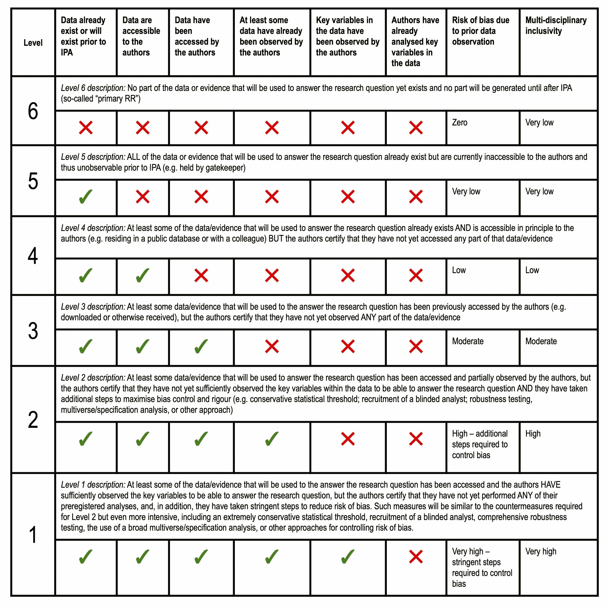

# Remedies to questionable research practices {#remedies}

There are several remedies, safeguards and countermeasures to prevent questionable research practices (QRPs). The list of remedies presented here is meant to be exhaustive and provide a brief overview of the advantages and disadvantages of each remedy. In this way, you will be able to find a remedy that is suitable for your circumstances and suggest an appropriate remedy for others.

The remedies are grouped into three themes:

- [Analysis](#analysis-stage): remedies during analysis, planning, and writing.
- [Publications](#publication-stage): remedies related to journals, reviewing, and publishing.
- [Institutions](#institution-stage): remedies for research groups, educators, universities, and government bodies.

<!--
How to write each remedy
------------------------
1. Short definition in first sentence
2. More detailed description + example
3. What it counteracts and how
4. Criticism against the remedy
-->

## Overview of remedies {#overview-remedies}

All humans have biases that can affect the research process and give misleading or false results. We can handle these biases in three ways:

- We can try to minimize the biases (as much as possible)
- We can try to control the biases (in a predictable manner)
- We can try to embrace the biases (and channel them in the right direction)

In the table below, you'll find an overview of the different remedies categorized according to how we can handle them. Note that this categorization is quite subjective and should be taken as a pedagogical help rather than ground truth. Nonetheless, we can see that most of the remedies are about minimizing or controlling biases, while only a few are about deliberately embracing biases.

Remedy | Minimizes bias | Controls bias | Embraces bias
:---------------------------------- | :------: | :------: | :------:
[Blind analysis]                    | &#10004; |          |
[Self-correction]                   | &#10004; |          |
[Retraction]                        | &#10004; |          |
[Whistleblowing]                    | &#10004; |          |
[Blogs and social media]            | &#10004; |          |
[Hoaxing]                           | &#10004; |          |
[Cross-discipline peer review]      | &#10004; |          |
[Join a network]                    | &#10004; |          |
[Supervisors]                       | &#10004; |          |
[Education]                         | &#10004; |          |
[Research culture]                  | &#10004; |          |
[Research integrity office]         | &#10004; |          |
[Increased sample size]             |          | &#10004; |
[Power analysis]                    |          | &#10004; |
[Change significance threshold]     |          | &#10004; |
[Replication]                       |          | &#10004; |
[Competing theories]                |          | &#10004; |
[21 word solution]                  |          | &#10004; |
[Standard operating procedures]     |          | &#10004; |
[Preregistration]                   |          | &#10004; |
[Registered report]                 |          | &#10004; |
[Preprint]                          |          | &#10004; |
[Open data]                         |          | &#10004; |
[Post-publication peer review]      |          | &#10004; |
[Changing incentives]               |          | &#10004; |
[Using Bayesian statistics]         |          |          | &#10004;
[Anonymous publication]             |          |          | &#10004; 
[Adversarial collaboration]         |          |          | &#10004; 

## Analysis {#analysis-stage}

### Competing theories {#competing-theories}

Letting two theories compete with each other is one way of rectifying the problem of questionable research practices.

The principle is simple. Instead of only testing one theory, you instead test two theories against each other. Not only does competition provide a more interesting test, it also give the opportunity for at least one of the theories to be wrong. In many circumstances, researchers have a single theory and the research is dedicated to theory-confirmation. That is, the theory should be confirmed in order to be published. This can lead to a [researcher confirmation bias](#confirmation-bias) and it becomes very difficult to know which theories are false when journals typically only accepts confirmed theories.

The downside is that there may not be two competing theories in your field. Instead, they may be similar but vague and are not really clearcut. This can certainly be a hinder but it can also fuel further theory development: if the theories are similar but vague, then it may need to be distinguished from each other.

### Increased sample size {#sample-size}

Using more participants or observations in a experiment or study help rectify problems of low [statistical power](power-analysis).

However, there is also a trade-off between sample size and money. Larger samples typically costs more money and can take considerably longer time to collect, for example when using complex machines like [fMRI](https://en.wikipedia.org/wiki/Functional_magnetic_resonance_imaging).

### Power analysis {#power-analysis}

Power analysis is a method to estimate the required sample size for a statistical test in order to be able to find a particular effect size (such as percentage, correlation, regression coefficient, mean difference etc.). Put simply, it's about determining how sensitive the test is in able to find what you are interested in. For insance, if you need to find a very small difference between two groups of people then you will also need a very sensitive test that can detect those small differences.

Without power analysis, it simply becomes a guessing game how many observations you need. Previous literature (or rule of thumbs) may not give sufficient information if they are themselves just a guessing game. Or worse, the previous literature be [p-hacked](#p-hacking), which means that the sample size reported in the literature are utterly unreliable to be able to find a particular size of an effect.

The power analysis require four pieces of information: the smallest *effect size* you are looking for, a *statistical power level* that says how many times (out of 100) you want to be able to find the effect, a *significance level* which states how many times (out of 100) you accept wrong results, and the type of statistical test such as regression or a t-test, one measurement or multiple etc. You decide all of these yourself, and they require trade-offs between design, resources and time. For example, the smaller the effect you are looking for, the more observations you need. This might cost a considerably amount of money.

If you look for very small differences without enough sensitivity (i.e., without sufficient power), it becomes very easy to be fooled by a significant result since the result itself cannot tell you if you had sufficient power. There are measures such as *post hoc power* that supposedly tell you the power of a test after it has been carried out, but these are meaningless and should not be used.^[The post hoc power can be estimated from the p-value since they are formally equivalent. A p-value < 0.05 gives about 50% post hoc power. Furthermore, if studies are selectively reported based on p-values then the post hoc power will reflect selective reporting and thus be misleading.]

Power analysis is only appropriate for frequentist statistics, not for [Bayesian statistics](#bayes) where the concept of power have no meaning.

::: {.rmdtip}
[G\*Power](https://www.psychologie.hhu.de/arbeitsgruppen/allgemeine-psychologie-und-arbeitspsychologie/gpower) is a free software that helps you with power analysis.
:::
    
### Replication {#replication}

A replication is to repeat an experiment or study in the same way in order to help determine whether some empirical effect exists. If the results from a replication is identical or highly similar to the original results, we say that the findings *replicated*.

Typically, one can distinguish between two types of replications: direct and conceptual. Direct replication is to conduct an identical study as close as possible (with the obvious differences of using another sample, different researchers, and so on) in order to determine the existence of an effect. Conceptual replication, on the other hand, means to operationalize the same concept (or effect) in a different way in order to see how far it can generalize.

Replications are a cornerstone for science to be trustworthy, but does not necessarily determine whether some empirical effect actually exists, for several reasons. First, direct replications are primarily used to rule out random error:

> direct replication, with its narrow focus on ruling out random error, is epistemically not very productive, because it has nothing to say about systematic error. [@feest_why_2019, 899]

Second, direct replications can still have conceptual problems. And these problems cannot be solved by conceptual replications since a conceptual replication assume the existence of the concept. For instance, if we assume that Santa Claus exists, and we start looking for reindeers and actually find them, the reindeers themselves does not provide us with evidence for Santa Claus. More strictly speaking:

> insofar as such replications involve concepts, they run [...] into the problem of conceptual scope, that is, the difficulty of determining, on the basis of independent and dependent variables of experiments, what precisely is the scope of the effect one is trying to replicate. [@feest_why_2019, 903]

There are also no strict rules on how large the discrepancy can be between the original results and the replicated results.

::: {.rmdnote}
Sometimes the terms "reproducibility" and "replication" are used interchangeably. Here, *replication* refers to doing a study again and *reproducibility* refers to the (narrower) computational reproducibility, which is when an analaysis or procedure can be performed again using a computer script.
:::

### Change significance threshold {#change-alpha}

In the social sciences, it is common to use p < .05 as a threshold for statistical significance, a threshold for a discovery or positive finding. This means that we allow, on avergage, that 5 percent of the false positives to be wrong by chance alone. However, when questionable research practices are used and only positive findings are published, the false positive rate is actually much higher.

This has lead several to suggest that researchers should lower the significance threshold to p < .005 [@benjamin_redefine_2018]. This will lead to drastically fewer published findings that are false. However, others have responded that researchers should instead justify what threshold they use [@lakens_justify_2018].

### Blind analysis {#blind-analysis}

Blind analysis means removing any identifying information before the analysis, only to add them back again once the analysis is finished.

The goal of blind analysis is to remove any unintentional biases, such as rerunning the analysis in a different way when the results are not in the preferred direction. A blind analysis thus "avoids the possibility of experimenters biasing their result toward their own preconceptions by preventing them from knowing the answer until the analysis is complete" [@klein_blind_2005, 141].

There are four ways to carry out a blind analysis:

1. **Hidden signal box**.
2. **Hidden answer methods**.
3. **Adding or removing events**.
4. **Data rescaling**.

### Using Bayesian statistics {#bayes}

[Bayesian statistics](https://en.wikipedia.org/wiki/Bayesian_inference), or Bayesian inference, is a philosophy of statistics that incorporates the researcher's subjective beliefs (*priors*) in the analysis. Today, the most common statistical philosophy used is [frequentist statistics](https://en.wikipedia.org/wiki/Frequentist_inference), or frequentist inference, usually in the form of Null-Hypothesis Significance Testing (NHST) which is epitomized by the p-value. 

Frequentism does not rely on subjective beliefs but instead on objective frequencies---how many times something happened in the world. However, these frequencies can also be a drawback because those things must happen with a certain regularity which can require quite large samples (hence the need for [power analysis](#power-analysis)). Another problem with NHST specifically is that it states a null hypothesis that is expected to be rejected, but it does not state what the alternative hypothesis is. The alternative could be the theory that is tested by the researcher or it could be something different (like QRPs). With Bayesian statistics, on the other hand, it is possible to directly test two theories against each other, instead of relying on only a rejection of a null hypothesis. It is also easier to use small samples with Bayesian statistics.

Although software exists for most Bayesian analyses one could think of, going full Bayes will nonetheless require retraining in philosophy and statistics which takes considerable time and effort. When samples are large, then the differences between Bayesian and frequentist statistics are virtually indistinguishable. This means that Bayesian statistics may be of most value for researchers who routinely rely on small samples.

### 21 word solution

@simmons_21_2012 [p. 1] suggested using the following sentence in the methods section:

> We report how we determined our sample size, all data exclusions (if any), all manipulations, and all measures in the study.

If the sample size is not determined in advance, for example, you could write something like this:

> We added 50 observations after analyzing the first 100.

### Standard operating procedures

Standard operating procedures (also called *SOP*) is a document that details the procedures and actions that are taken by the researcher in the absence of any other instructions. For instance, you may not have a plan for [outlier exclusion](#outlier-exclusion) during data analysis in your research project but may still encounter problems of outliers. The standard operating procedure gives standard advice or instructions on how to handle the outliers, which ensures that ad hoc solutions are avoided and thus decreases the chances of a misleading result. Two researchers who work independently of each other and face a similar situation should therefore be able to resolve the problem using the standard operating procedure.

The document is based on years of experience and states how these situations should be handeled in a standard way under normal circumstances. The document should be public (or at least available to all members of a researech group) in order for all members to be knowledgeable about what to do, and to check each other's results.

## Publications {#publication-stage}

### Preregistration {#preregistration}

```{r preregistration-levels, fig.scap="Preregistration levels.", fig.cap="A study can be preregistrated in many ways. It depends on whether the data is available before the study is conducted. Figure from [Peer Community In Registered Reports](https://rr.peercommunityin.org/help/guide_for_authors#h_95790490510491613309490336)."}

```

Preregistration means registering hypotheses, methods or analyses of a study before the study is conducted. The preregistration is documented beforehand and briefly describe the hyptheosis, what methods are used, how data collection and analysis is carried out, and so on. The preregistration can be submitted to one of many online repositories where it recieves a timestamp which makes is possible to determine when the preregistration was conceived. As a researcher, you can then choose if you want to make the preregistration public immediately or wait until publication.

Preregistration does not prevent questionable research practices from occuring, but makes it transparent what the authors said they were going to do and what they actually did. For instance, if a researcher preregister an experimental hypothesis and later changes the hypothesis to fit the evidence (so called [HARKing](#harking)), readers will be able to tell from reading both the preregistration and the article. Likewise, if data collection or data analysis were not mentioned in the preregistration, then it would also be apparent that any [outlier exclusion](#outlier-exclusion) was made after the fact.

There are many parts of the research process that can be preregistered (see figure \@ref(fig:preregistration-levels)). Primary data collection, such as an experiment, can be preregistered. This result in the lowest bias since the researcher couldn't look at the data before the data collection. Secondary data analyses, such as systematic reviews and meta-analyses, can also be preregistered, But the risk of biases increase the more the researchers have had the ability to peak at the data beforehand.

A common misconception is that the researcher cannot deviate from the preregistration protocol. However, the researcher can deviate in any way appropriate and it's unlikely that all problems could be foreseen. The point is that it becomes obvious that a deviation happened. This means that a study does not automatically become unbiased or "good" because it was preregistered. The amount of bias rather depends on how strictly the preregistration protocol was followed by the researcher, and whether the preregistration was sufficiently unambiguous.

See also [registered report](#registered-report), which is an article format offered by journals with a similar purpose.

### Registered report {#registered-report}

```{r registered-report-stages, fig.scap="Registered report.", fig.cap="A registered report is an article format written in two stages with peer review after each stage."}
knitr::include_graphics("images/registered-reports.png")
```

A registered report is a journal article format with peer review before results are known.^[Registered reports were not introduced until the early 2010's, although medicine have had similar registrations for medical trials for a longer period. One of the first to mention registered report as an article format was @mahoney_scientist_1976 [p. 105] who called it a *contracted report*.] Registered reports are conducted in two stages:
 
1. **In the first stage** you write a journal article with introduction and methods section and send it to the journal for peer review. The reviewers give feedback on the introduction and feasability of the method. If the paper is accepted then it is accepted *regardless* of what the results will show. You then carry out the data collection and analyze the results.
2. **In the second stage** you send the full article, including results and discussion section, to the journal. The reviewers then compare whether you did what you intended to do, and whether the conclusions follow from the data. The reviewers cannot object to the results at this stage because they have already agreed to the study design.

The benefits of registered report are several. You can receive feedback on your design *before* data collection, which is often more valuable than getting the feedback afterwards when the data collection is already carried out, payed for, and no changes can be made. This is the main difference compared to [preregistration](#preregistration). Registered reports also help counteract [publication bias](#publication-bias) because it's not the unexpected results that determine publication, but the study rationale and the strength of the study design. As long as you follow through on the promises made in the first stage, neither reviewers nor editors should deny publication based on the results.

You can find a list of journals that supports registered reports on <https://www.cos.io/initiatives/registered-reports>.

### Preprint {#preprint}

A preprint is a research paper that is made publicly available before the paper is reviewed or published in a journal. The preprint can be published in one of the numerous [preprint servers](#resources) that exists online.

Preprints counteract [publication bias](#publication-bias) because negative findings can be published.

### Open data {#open-data}

Open data means sharing datasets and other types of research material in order to make it openly accessible for anyone. Others can then verify the data and the conclusions derived from the data. Open data also makes it possible to help identify fraud, cherry-picking and simple mistakes since it becomes possible to run the analyses and compare findings with the published manuscript.

Some open data are completely open and you just download it like any other file found on the internet. Other open data may be more sensitive and there are different levels of openness. Some may require registration and some others may require authenticatation.

There are also several tools that can help you anonymize your dataset. For instance:

- [synthpop](https://synthpop.org.uk/) - generates a synthetic version of individual-level data. Available as an R package.
- [semproducible](https://github.com/peterdalle/semproducible) - turns a lavaan model into reproducible code without disclosing the raw data. Just can then paste the code in the appendix of a journal article. Available as an R package.

If you make your data open, it is important to give the data an open license that states what others can and cannot do with the data.

::: {.rmdnote}
Research data is sometimes called *FAIR*, which stands for findability, accessibility, interoperability, and reusability. You can read more at <https://en.wikipedia.org/wiki/FAIR_data>.
:::

### Self-correction {#self-correction}

Self-correction is to publicly disclose how and why one's own published research findings may not be what they seem to be at a first glance. Science is often said to be self-correcting, at least at an institutional level, but there are very few instances of actual scientists self-correcting their own research, even though "loss-of-confidence sentiments are surprisingly common among members of the broader scientific population yet rarely become part of the public record" [@rohrer_putting_2021, 1255]. 

Although this might seem like a freightening thing to do, several researchers have already paved the way. In @rohrer_putting_2021, for instance, 13 scientists told about the loss of confidence of their own research findings and the reasons they lost it. 

Salary and prestige are often tied to having confirmed theories and many publications, which means that disclosing the confirmed theories as untrue can be a risky strategy to pursue. However, it might also be an even riskier strategy to failing to correct one's own research record if others find flaws in it later on. If you do not correct your own scientific record, then you are also implicitly asserting that all your previous work is still correct and valid.

Retroactive disclosure statements is another way to not only self-correct, but also to emphasize the correct findings. They can be made for studies that does *not* contain any questionable research practices. For instance, a researcher could write on their own website that all methods and findings were reported as they were stated in a particular paper, which inform other researchers about the credibility of the research. This method could be valuable when commenting on journals that have a very conservative policy on article formats.

### Anonymous publication {#anonymous-publication}

Publishing anonymous or under a pseudonym is a way for a researcher making other perspectives salient without necessarily having focus drawn to the person behind the text. In this way, it can be easier to expose questionable research practices, especially if it would endanger or threaten the researcher's career (such as in an environment dominated by [activism](#activism)).

The [Journal of Controversial Ideas](https://www.journalofcontroversialideas.org/) is one publication that is dedicated to publishing ideas that may be controversial in their discipline and that may be difficult to publish in other places, such as views that many people regard as "morally, socially, or ideologically objectionable or offensive" as the journal puts it. The authors can publish under a pseudonym.

Publishing anonymous can help prevent [conformism](#conformism) within a discipline, where it may be difficult to use one's real name without repercussions or threats to physical safety.

### Retraction

Retracting a paper is to withdraw the paper from a scientific publication. The reasons for retractions can vary greatly, from simple publishing mistakes to fraud and data fabrication.

It is important to note that a retraction is not a penalty, but rather a means of correcting the scientific record so that other researchers do not accept false claims.

However, the efficacy of retractions can be questioned. Some studies have shown that retracted articles are still cited many years afterwards.

### Checklists

There are many checklists developed to help researchers avoid questionable research practices. For instance:

- Checklists to avoid p-hacking [@wicherts_degrees_2016].

### Whistleblowing

If questionable research practices occur systematically by many researchers, or through research findings that are popular, then it can be difficult to expose them from within research itself. It can be difficult to have criticism published for various reasons.

This is where journalists and news media play an important role for whistleblowers who want to shed light on research that is deemed fraudulent or otherise.

A researcher who considers whistleblowing should be aware of the risks, such as losing their job, having their reputation destroyed, and being litigated. Good counselling about the law and the career implications is important, which a union can help you with. 

On the other hand, knowing and accepting that others are carrying out fraudulent or misleading research without exposing it is also a risk that should be taken into account.

### Peer review

Peer review is the evaluation of a manuscript by other researchers before publication. Today, peer review is one of the most common ways research is vetted before publication in a journal. This can be contrasted to [post-publication peer review](post-publication-peer-review) which occurs after publication.

The editor of a journal (or conference) selects one or more reviewers who review the manuscript and suggest changes. The review is often blind, which means that reviewers don't know who the author is (and vice versa) until publication. This prevents that author name or university name biases the evaluation, which thereby minimizes the [authority hueristic](#heuristics). But the reviewing can also be open, where the reviewers are aware of the author's identity. Based on the reviewers' evaluation, the editor can accept or reject the manuscript, or require further revisions. The reviewing can take several rounds until the editor and reviewers are happy, and usually takes months and even years in some cases.

Peer review is the dominating way of catching questionable research practices at the moment. However, peer review is also subject to questionable research practices of its own, since a reviewer can engage in [selective rigor] by applying higher standards for research that the reviewer dislikes, or by stopping or delaying the research [@dahlgren_instructions_2022]. If the review evaluations are not made public, these practices can also go more or less unnoticed in a discipline.

### Post-publication peer review {#post-publication-peer-review}

Post-publication peer review is peer review after an article has been published in a journal.

As the statistician and political scientist Andrew Gelman have argued, the standard view seems to be that "once an article is published in some approved venue, it should be taken as truth" [@gelman_2016]. However, he also noted that this is inadequate for science since "many published papers are clearly in error" and that "publication itself is such a crapshoot that it's a statistical error to draw a bright line between published and unpublished work" [@gelman_2016].

Post-publication peer review emphasize peer review as ongoing and does not stop just because something is published. However, there are few formal ways of conducting peer review after publication, and many journals are reluctant to publishing criticism of already published articles.

For this reason, alternatives such as [PubPeer](https://pubpeer.com/) has entered the scence, whih is a website that provides a way of finding comments about any article published in any journal, like a layer on top of all journals. You can also post comments yourself. This is an easy way of doing post-publication peer review, and through the PubPeer browser plugin it can also notify you when you visit an online journal article that has comments on PubPeer.

### Cross-discipline peer review

Cross-discipline peer review means that researchers from outside a discipline reviews the work from a particular discipline.^[I haven't found any references to such an idea in the literature. The term *cross-discipline peer review* is my idea, but I'm happily corrected if there's an established term.]

A problem with small disciplines, or very [homogenous disciplines](#researcher-homogeneity) characterized by [conformism], is that some viewpoints can dominate while dissenting viewpoints disappears (or are already long gone). When everyone thinks the same it becomes difficult to submit an article with evidence that oppose this viewpoint, since the reviewers are colleagues from within the discipline that are likely to engage in [selective rigor]. 

With cross-discipline peer review, researchers from outside the discipline carry out independent reviewing of the published literature. However, reviewers from another discipline does not have the subject knowledge found within the discipline. But the point of cross-discipline peer review is not to evaluate subject knowledge, but rather to counteract the types of biases that might have arisen from the homogenous research environment itself. These does not necessarily require the specific subject-knowledge expertise found within the discipline. 

There are two ways one can view the research process, which we can dub the territorial paradigm and the factual paradigm:

- In the **territorial paradigm**, the "researchers identify with a subdiscipline [...] including its methodology, publication outlets, and conferences, and ignore everything outside this professional frame" [@gigerenzer_personal_2010, 740]. 
- In the **factual paradigm**, "researchers identify with a topic [...] and ignore disciplinary borders, using all methodologies and knowledge available to understand the topic" [@gigerenzer_personal_2010, 740]. 

Many disciplines are territorial, where the point is to uphold borders to other disciplines and decide who gets to speak, and who is considered an authority. It's healthy to remind ourselves now and then that we are primates and primates are animals, and that we are in fact just monkeys in fancy suits trying to protect our territories. Cross-discipline peer review is intended to downplay the terrotorial paradigm and instead emphasize a factual paradigm.

Cross-discipline peer review is initiated from outside the discipline that is under scrutiny, simply from the fact that the discipline is unlikely to scrutinize itself. For similar reasons, we do not judge astrology by what astrologers say about themselves, but by what astronomers say.

Parts of gender sociology, for example, have been found to act like insulated islands that more or less only cite studies that are within their own discipline, even though their research is about human behavior---why men and women do what they do---that could benefit from evidence in the natural sciences [@stern_undoing_2016].

### Blogs and social media

Using social media or blogs to call attention to questionable research practices is an increasingly important way that research is carried out, which is an informal part of the [post-publication peer review](#post-publication-peer-review). Scientific journals are primarily occupied with formal article formats (such as empirical articles, reviews, or commentaries) and it can be difficult and time-consuming to criticize research in a way that is suitable for one of those predefined article formats.

Journals may also require peer review and can even invite the researcher who is subject of the criticism to review the paper. Obviously, the person under criticism have a strong incentive to reject the paper which makes criticism difficult to even surface.

Blogs and social media breaks down the gatekeeping function that journals typically have had, and makes it possible to exchange ideas without moderation or censorship, which increases the chances that questionable researche practices can be called out and noticed. 

However, just because criticism is posted on blogs or social media does not mean that it is guaranteed to be true (which applies to journals as well). The power of blogs and social media is instead to make it possible for others to openly evaluate whether the claims are indeed true, which would not be possible if the criticism was prematurely rejected by a journal on other grounds than the validity of the criticism itself. 

Blogs and social media are not without problems of their own. They do not become part of the scientific record and it can be difficult to find them in the future if the blog shuts down. However, this is similar to chats at academic conferences where a handful of people talk to each other about bad research without any written account that others can see. Blogs and social media at least makes it possible for informal conference talk to surface in a more transparent way than before, and cited posts can be archived.

::: {.rmdtip}
Use <https://web.archive.org/> to find (and link to) old blog posts that are not available online anymore.
:::

### Hoaxing

Scientific hoaxes (or pranks) refers to deliberately creating falsehoods and having them accepted by the scientific community, and then exposing them as falsehoods.

The Sokal hoax, for instance, is a famous hoax where the American physicist Alan Sokal wrote a paper with nonsensical jargon where he argued that quantum gravity is a social and linguistic construct.^[Read Alan Sokals paper, *Transgressing the Boundaries: Towards a Transformative Hermeneutics of Quantum Gravity*, at <https://physics.nyu.edu/faculty/sokal/transgress_v2/transgress_v2_singlefile.html>.] Sokal submitted the paper to the journal Social Text because he believed the paper would align with the editor's political ideology. When the paper was published, Sokal revealed the hoax which sparked a heated debate about research ethics.

Hoaxes can expose questionable research practices by using the very same standards, norms or practices as the research community to reach absurd conclusions (by [*reductio ad absurdum*](https://en.wikipedia.org/wiki/Reductio_ad_absurdum)). The ethical nature of hoaxes and pranks, however, can be debated. For instance, it it possible to show that accepted research practices lead to absurd conclusions and still transparently report them as such [e.g., @simmons_false-positive_2011]. The hoax itself nonetheless provides an opportunity to highlight the questionable practice in the public eye.

## Institutions {#institution-stage}

### Join a network

You can also join a research network of group of people who want to improve research practices. For instance, reproducibility networks are groups of people who are working towards increasing trustworthiness and transparency of scientific research. They investigate the factors that contribute to robust research via training, research and work with  funders, publishers and other institutions to make research better.

The important point here is not that these networks need to be about reproducibility, but rather that these are *networks* of people who have the same goal (e.g., improving science and research practices). By joining one such group or network, you gain support from colleagues in a similar position (whether you're a PhD student or a junior scholar) and can bounce your ideas off them. This makes it easier to stand up for what you believe is right during moral dilemmas or when you have a supervisor, funder or other or that pressure you to reach a particular conclusion in your research.

### Adversarial collaboration

An adversarial collaboration is when two or more scientists with opposing views work together.^[The concept of an adversarial collaboration was coined by the psychologist Daniel Kahneman.] Sometimes it's also called *red team versus blue team*.

The idea behind an adversarial collaboration is that all humans have biases and we can either try to get rid of them, try to control them, or embrace them. The adversarial collaboration tries to embrace the biases by making both research teams use their own biases when constructing the research design and interpreting the empirical evidence. The idea is that the biases of both groups will cancel each other out, since both groups can point out biases in each other's work. The goal is then to design a study that satisfies both sides, and that there are no obvious weaknesses in the design that favors only one side of the debate.

And if the groups cannot agree on the analysis, for example, they could both write their own interpretations in the same manuscript in order to let the readers decide. These two perspectives are very unlikely to be written on the same data if the research was only carried out by one of the groups alone.

### Changing incentives

### Supervisors

Supervisors "have an important function in shaping students’ attitudes towards QRPs" [@krishna_questionable_2018, 1].

### Education

Education in open science and ethical research is another way to remedy questionable research practices.

@greenland_need_2017 suggested that we need to bring cognitive psychology into methodology.

However, one paper that reviewed the outcomes suggested that "a course in research misconduct [...] should not be expected to have a significant effect" [@kornfeld_perspective_2012, 877]. 

### Prediction markets

### Research culture

### Research integrity office {#integrity-office}

Research integrity offices surveil the research output and the researchers in order to uphold the standards of research integrity. In some countries they are part of the universities themselves, and in other countries they are their own government agencies.

Just like the [incentive structure](#incentives), the research integrity offices provide incentives for a researcher to behave in accordance with the scientific norms. In contrast to the positive incentives that the incentive structure is supposed to uphold, the researcher may instead receive a punishment from the research integrity office when they commit scientific fraud or questionable research practices.

Research integrity offices are usually the last resort when scientific fraud or questionable research practices cannot be resolved by the research process itself or by the research communities themselves.

## Summary {#remedies-summary}

These remedies are are no cure-all for questionable research practices, nor will they stop all unethical behaviors. A researcher who wants to lie will find a way. However, the remedies nonetheless makes research a little more difficult to fake and a little bit easier for others to identify, which is an important first step.
