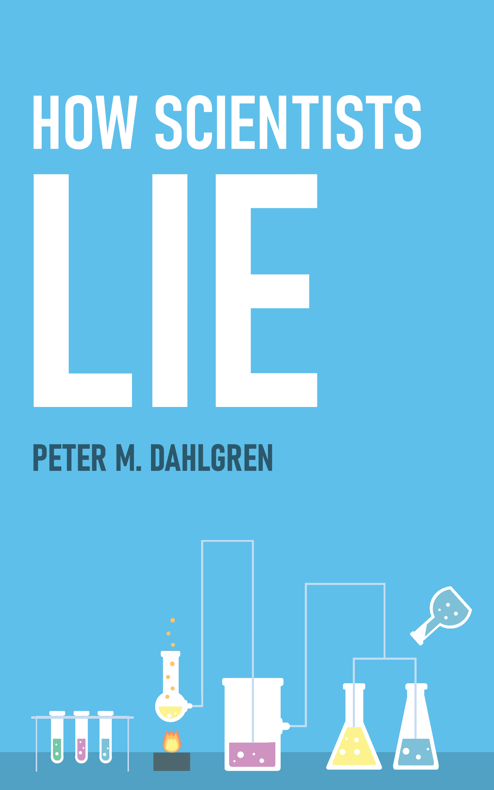

--- 
pagetitle: "How Scientists Lie"
title: "How Scientists Lie"
subtitle: "Questionable Research Practices and its Remedies"
author: "Peter M. Dahlgren"
date: "`r Sys.Date()`"
knit: "bookdown::render_book"
site: bookdown::bookdown_site
output: bookdown::bs4_book
documentclass: book
bibliography: book.bib
biblio-style: apalike
csl: includes/apa6.csl
lot: true
lof: true
number-sections: true
link-citations: true
links-as-notes: true
colorlinks: true
github-repo: peterdalle/how-scientists-lie
cover-image: images/cover.png
favicon-image: images/favicon-196.png
twitter-handle: peterdalle
url: https://howscientistslie.com/
description: "A book about questionable research practices (QRPs) and its remedies. A guide to misleading science and research and how we can improve it."
include-before: |
    

---

# How Scientists Lie {- #intro}

How do scientists lie? Which strategies do they use? The book [*How Scientists Lie*](https://howscientistslie.com/) provides a catalogue of questionable research practices, or QRPs, the steroids of research. It's a book about how bad research practices drive away the good ones, and how bad practices can be identified and rectified.

This book is for students and junior researchers in the social sciences, the natural sciences, and the humanities, as well as others who have an interest in empirical research that does not mislead.

<small>
This is the work-in-progress toward the 1st edition. You can influence the creation of this book. Visit the [GitHub repository](https://github.com/peterdalle/how-scientists-lie) and contribute.
</small>

## Support the book {- #support-book}

If you find the book useful, you can:

- Use the book in your teaching
- Tell people about the book
- Link to the book on social media
- Review, proofread or suggest changes
- [Cite the book](#cite) in your own work
