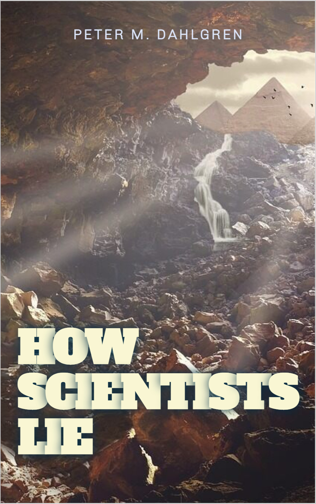

--- 
title: "How Scientists Lie"
subtitle: "Catalogue of Questionable Research Practices"
author: "Peter M. Dahlgren"
date: "`r Sys.Date()`"
knit: "bookdown::render_book"
site: bookdown::bookdown_site
output: bookdown::bs4_book
documentclass: book
bibliography: [book.bib]
biblio-style: apalike
link-citations: true
links-as-notes: true
colorlinks: true
github-repo: peterdalle/how-scientists-lie
cover-image: images/cover.png
url: https://howscientistslie.com/
description: "Questionable Research Practices in the Name of Science. A guide to the ways science is carried out to advance careers rather than research."
---

# Welcome to How Scientists Lie {-}

<a href="./"></a>

How do scientists lie? What strategies are available? This online book [*How Scientists Lie*](https://howscientistslie.com/) provides a catalogue of questionable research practices (QRPs), which are the steroids of research, and reviews countermeasures to correct them.

You can visit the [GitHub repository for this book](https://github.com/peterdalle/how-scientists-lie) and contribute.

<a rel="license" href="https://creativecommons.org/licenses/by-nc-sa/4.0/"></a><br />This work by [Peter M. Dahlgren](https://peterdahlgren.com/) is licensed under a <a rel="license" href="https://creativecommons.org/licenses/by-nc-sa/4.0/">Creative Commons Attribution-NonCommercial-ShareAlike 4.0 International License</a>.

# Preface {-}

This book is a pedagogical introduction to questionable research practices, the steroids of research.

## Outline {-}

- **Chapter \@ref(qrp)** describes what questionable research practices (QRPs) are, and how often they are used.
- **Chapter \@ref(catalogue)** outlines several types of questionable research practices that has been identified in the research literature.
- **Chapter \@ref(countermeasures)** suggests how questionable research practices can be prevented.
* **Chapter \@ref(reasons)** introduces several explanations as to why scientists lie.
* **Chapter \@ref(integrity)** reminds you of research integrity and ethics.

## About this book {-}

This book is free of charge. Books at scientific publishing companies are usually too expensive for buyers and receives little attention. It's easier for everyone to just access it online.

## About the author {-}

[Peter M. Dahlgren](https://peterdahlgren.com/), PhD, is specialized in how people search for information, and also studies metascience.

## Roadmap {-}

The path forward for the book:

1. Expand catalogue of QRPs and their prevalence
2. Give real-world examples
3. Expand catalogue of countermeasures
4. Proof-read

You can contribute to the book via the [GitHub repository](https://github.com/peterdalle/how-scientists-lie), and will be included in the acknowledgment or as an author depending on the significance of your contribution. The book is written in Markdown using the [bookdown](https://bookdown.org/) R package.

## How to cite this book {-}

Dahlgren, P. M. (2022). *How Scientists Lie*. <https://howscientistslie.com/>

```
@book{how_scientists_lie,
  title = {How {{Scientists Lie}}},
  author = {Dahlgren, Peter M.},
  year = {2022},
  url = {https://howscientistslie.com/}
}
```

# E-mail course {-}

Are you a student, junior scholar or a journalist? Do you want to know more about how scientists lie and questionable research practices?

Subscribe and receive the gist of the book in short and reader-friendly e-mails.

You'll learn about how scientists lie, one short e-mail at a time, delivered every two weeks.

<form accept-charset="utf-8" action="https://www.backendmedia.se/sendy/subscribe" method="POST"><input class="form-input" id="email" name="email" placeholder="Your e-mail" required="" style="width:250px" type="email" />
<div style="display:none;"><label for="hp">HP</label><br />
<input id="hp" name="hp" type="text" /></div>
<input name="list" type="hidden" value="Y9Ob892763bD3Je2p0763oCcbMhQ" /> <input name="subform" type="hidden" value="yes" /> <input class="btn" id="submit" name="submit" type="submit" value="Subscribe" />
</form>
	
Privacy: Your e-mail is only collected and stored for the purpose of this list. Opt-out link is included in each e-amil.
